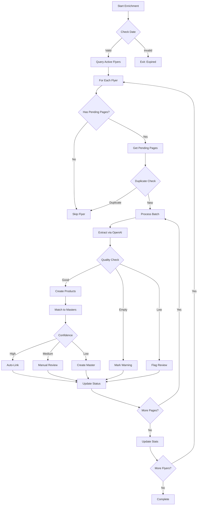

# Flyer AI Enrichment Implementation Plan

## Executive Summary

This document provides a comprehensive implementation plan for adding AI-powered enrichment capabilities to the Kainuguru flyer processing system. The system will use OpenAI's Vision API to extract product information from flyer images, with intelligent date-based processing, duplicate prevention, quality validation, and full product master matching.

## Table of Contents
1. [System Analysis Summary](#system-analysis-summary)
2. [Architecture Overview](#architecture-overview)
3. [Implementation Phases](#implementation-phases)
4. [Core Components](#core-components)
5. [Processing Algorithm](#processing-algorithm)
6. [Database Integration](#database-integration)
7. [Quality Control](#quality-control)
8. [Product Master Matching](#product-master-matching)
9. [Error Handling](#error-handling)
10. [Testing Strategy](#testing-strategy)
11. [Production Deployment](#production-deployment)
12. [Command Usage](#command-usage)
13. [Timeline & Milestones](#timeline--milestones)
14. [Success Metrics](#success-metrics)

---

## System Analysis Summary

### Current State
- ✅ **100% Complete**: Scraping → PDF → Images → Storage → Database
- ⚠️ **50% Complete**: AI Extraction Infrastructure (code exists but not integrated)
- ❌ **0% Complete**: Enrichment Command, Product Creation, Master Matching

### Key Findings
1. **Database schema fully ready** with comprehensive tables for flyers, pages, products, and masters
2. **AI extractor service exists** but lacks database integration
3. **Storage system operational** with filesystem and S3-ready architecture
4. **Job queue infrastructure ready** but no enrichment jobs being created
5. **Product service methods unimplemented** (CreateBatch returns "not implemented")

### Gap Analysis
| Component | Status | Missing |
|-----------|--------|---------|
| Scraper | ✅ Complete | None |
| Storage | ✅ Complete | None |
| Database Schema | ✅ Complete | None |
| AI Extractor | ⚠️ Partial | Database integration |
| Enrichment Command | ❌ Missing | Full implementation |
| Product Service | ❌ Incomplete | CreateBatch method |
| Product Matching | ❌ Missing | Matching service |
| Quality Validation | ❌ Missing | Validation service |

---

## Architecture Overview

### Data Flow Architecture

```
┌─────────────────────────────────────────────────────────────────────┐
│                         CURRENT IMPLEMENTATION                        │
├─────────────────────────────────────────────────────────────────────┤
│  Websites → Scraper → PDF → Images → Filesystem → Database          │
│    (IKI)     ✅       ✅     ✅        ✅           ✅              │
│  (Maxima)                                                            │
└─────────────────────────────────────────────────────────────────────┘
                                    ↓
┌─────────────────────────────────────────────────────────────────────┐
│                      ENRICHMENT PIPELINE (TO BUILD)                  │
├─────────────────────────────────────────────────────────────────────┤
│  Pending Pages → AI Extractor → Products → Product Masters          │
│       ❌            ⚠️            ❌           ❌                   │
│                                                                       │
│  Components to Build:                                                │
│  1. Enrichment Command (cmd/enrich-flyers)                          │
│  2. Enrichment Service (orchestration)                               │
│  3. Product Creation Service                                         │
│  4. Master Matching Service                                          │
│  5. Quality Validation                                               │
└─────────────────────────────────────────────────────────────────────┘
```

### Database Schema

```sql
-- Core Tables (Ready)
flyers                    -- Flyer metadata with processing status
├── flyer_pages          -- Individual pages with extraction_status
│   └── products         -- Extracted products (partitioned by date)
│       └── product_masters -- Deduplicated catalog

-- State Flow
extraction_status: pending → processing → completed/failed/warning
needs_manual_review: boolean flag for quality issues
raw_extraction_data: JSONB storage for AI responses
```

### Service Architecture

```
cmd/enrich-flyers/
├── main.go              -- Entry point with CLI flags
└── enricher.go          -- Core enrichment logic

internal/services/
├── enrichment_service.go    -- Orchestration layer
├── product_service.go       -- Product CRUD operations
├── flyer_page_service.go    -- Page state management
├── product_master_service.go -- Master matching
├── ai/
│   ├── extractor.go        -- OpenAI Vision integration
│   └── prompt_builder.go   -- Prompt generation
├── matching/
│   └── matcher.go          -- Fuzzy matching algorithms
└── validation/
    └── quality_checker.go  -- Quality assessment
```

---

## Implementation Phases

### Phase 1: Core Infrastructure (Day 1)

#### 1.1 Create Enrichment Command
**File**: `cmd/enrich-flyers/main.go`

```go
package main

import (
    "flag"
    "time"
    "context"
)

var (
    storeCode     string
    dateOverride  string
    forceReprocess bool
    maxPages      int
    batchSize     int
)

func main() {
    flag.StringVar(&storeCode, "store", "", "Process specific store (iki/maxima)")
    flag.StringVar(&dateOverride, "date", "", "Override date (YYYY-MM-DD)")
    flag.BoolVar(&forceReprocess, "force-reprocess", false, "Reprocess completed pages")
    flag.IntVar(&maxPages, "max-pages", 0, "Maximum pages to process (0=all)")
    flag.IntVar(&batchSize, "batch-size", 10, "Pages per batch")
    flag.Parse()

    // Implementation details in enricher.go
}
```

#### 1.2 Implement Enrichment Service
**File**: `internal/services/enrichment_service.go`

Key methods:
- `ProcessActiveFlyers(ctx, date)` - Main orchestration
- `ValidateFlyerEligibility(flyer, date)` - Check dates
- `DetectDuplicateProcessing(page)` - Prevent re-extraction
- `AssessExtractionQuality(result)` - Quality scoring

#### 1.3 Complete FlyerPageService
**File**: `internal/services/flyer_page_service.go`

```go
func (s *flyerPageService) GetPagesForProcessing(ctx context.Context, flyerID int, limit int) ([]*models.FlyerPage, error) {
    query := `
        SELECT fp.* FROM flyer_pages fp
        JOIN flyers f ON fp.flyer_id = f.id
        WHERE f.valid_from <= $1
        AND f.valid_to >= $1
        AND fp.extraction_status IN ('pending', 'failed')
        AND fp.extraction_attempts < $2
        ORDER BY fp.page_number
        LIMIT $3
    `
    // Implementation
}
```

### Phase 2: Product Creation & Storage (Day 1-2)

#### 2.1 Implement Product Service
**File**: `internal/services/product_service.go`

```go
func (s *productService) CreateBatch(ctx context.Context, products []*models.Product) error {
    // 1. Validate products
    for _, p := range products {
        if err := s.validateProduct(p); err != nil {
            return fmt.Errorf("invalid product: %w", err)
        }
    }

    // 2. Normalize Lithuanian text
    for _, p := range products {
        p.NormalizedName = normalize.Lithuanian(p.Name)
        p.SearchVector = generateSearchVector(p.NormalizedName)
    }

    // 3. Calculate discounts
    for _, p := range products {
        if p.OriginalPrice > 0 {
            p.DiscountPercent = (p.OriginalPrice - p.CurrentPrice) / p.OriginalPrice * 100
        }
    }

    // 4. Batch insert with partition handling
    return s.batchInsertWithPartitions(ctx, products)
}
```

#### 2.2 Enhance AI Integration
**Updates to**: `internal/services/ai/extractor.go`

- Add quality scoring mechanism
- Implement minimum threshold checking
- Store raw responses for debugging
- Handle warning states

### Phase 3: Product Master Matching (Day 2-3)

#### 3.1 Create Matching Service
**File**: `internal/services/matching/matcher.go`

```go
type MatchResult struct {
    MasterID    int64
    Confidence  float64
    MatchType   string // exact, fuzzy, brand, category
    ShouldLink  bool   // auto-link if confidence > 0.85
}

type Matcher interface {
    FindBestMatch(ctx context.Context, product *models.Product) (*MatchResult, error)
    CreateMasterFromProduct(ctx context.Context, product *models.Product) (*models.ProductMaster, error)
}
```

#### 3.2 Matching Algorithm

```go
func (m *matcher) FindBestMatch(ctx context.Context, product *models.Product) (*MatchResult, error) {
    // 1. Exact normalized name match
    if master := m.findExactMatch(product.NormalizedName); master != nil {
        return &MatchResult{
            MasterID:   master.ID,
            Confidence: 1.0,
            MatchType:  "exact",
            ShouldLink: true,
        }, nil
    }

    // 2. Fuzzy trigram similarity
    if masters := m.findFuzzyMatches(product.NormalizedName, 0.7); len(masters) > 0 {
        best := m.selectBestFuzzyMatch(masters, product)
        return &MatchResult{
            MasterID:   best.ID,
            Confidence: 0.8,
            MatchType:  "fuzzy",
            ShouldLink: best.Similarity > 0.85,
        }, nil
    }

    // 3. Brand + partial name
    if product.Brand != "" {
        if master := m.findByBrandAndPartialName(product.Brand, product.Name); master != nil {
            return &MatchResult{
                MasterID:   master.ID,
                Confidence: 0.6,
                MatchType:  "brand",
                ShouldLink: false, // Require manual review
            }, nil
        }
    }

    // 4. No match - create new master
    return nil, nil
}
```

### Phase 4: Quality Control (Day 3)

#### 4.1 Quality Validation Service
**File**: `internal/services/validation/quality_checker.go`

```go
type QualityAssessment struct {
    Score           float64
    ProductCount    int
    AverageConfidence float64
    Issues          []string
    RequiresReview  bool
    State           string // completed, warning, failed
}

func (q *qualityChecker) AssessPage(extraction *ExtractionResult) *QualityAssessment {
    assessment := &QualityAssessment{
        ProductCount: len(extraction.Products),
    }

    // Check product count thresholds
    switch {
    case assessment.ProductCount == 0:
        assessment.State = "warning"
        assessment.Issues = append(assessment.Issues, "No products extracted")
        assessment.RequiresReview = true
        assessment.Score = 0.0
    case assessment.ProductCount < 5:
        assessment.State = "warning"
        assessment.Issues = append(assessment.Issues, "Low product count")
        assessment.RequiresReview = true
        assessment.Score = 0.4
    default:
        assessment.State = "completed"
        assessment.Score = 1.0
    }

    // Calculate average confidence
    var totalConfidence float64
    for _, p := range extraction.Products {
        totalConfidence += p.Confidence
    }
    assessment.AverageConfidence = totalConfidence / float64(len(extraction.Products))

    // Check confidence threshold
    if assessment.AverageConfidence < 0.5 {
        assessment.RequiresReview = true
        assessment.Issues = append(assessment.Issues, "Low confidence scores")
    }

    return assessment
}
```

---

## Core Components

### Enrichment Command Structure

```go
// cmd/enrich-flyers/enricher.go
type Enricher struct {
    db          *sql.DB
    aiExtractor *ai.Extractor
    enrichmentSvc *services.EnrichmentService
    productSvc    *services.ProductService
    matchingSvc   *matching.Matcher
    qualitySvc    *validation.QualityChecker
}

func (e *Enricher) ProcessFlyers(ctx context.Context, opts ProcessOptions) error {
    // 1. Get eligible flyers
    flyers, err := e.enrichmentSvc.GetEligibleFlyers(ctx, opts.Date)
    if err != nil {
        return fmt.Errorf("failed to get eligible flyers: %w", err)
    }

    // 2. Process each flyer
    for _, flyer := range flyers {
        if err := e.processFlyer(ctx, flyer, opts); err != nil {
            log.Error().Err(err).Int("flyerId", flyer.ID).Msg("Failed to process flyer")
            continue // Skip to next flyer
        }
    }

    return nil
}

func (e *Enricher) processFlyer(ctx context.Context, flyer *models.Flyer, opts ProcessOptions) error {
    // Get pending pages
    pages, err := e.enrichmentSvc.GetPendingPages(ctx, flyer.ID)
    if err != nil {
        return err
    }

    // Check for duplicate processing
    if !opts.ForceReprocess && len(pages) == 0 {
        log.Info().Int("flyerId", flyer.ID).Msg("No pending pages to process")
        return nil
    }

    // Process in batches
    for batch := range chunk(pages, opts.BatchSize) {
        e.processBatch(ctx, batch, flyer)
    }

    // Update flyer statistics
    return e.enrichmentSvc.UpdateFlyerStats(ctx, flyer.ID)
}
```

---

## Processing Algorithm

### Main Processing Flow



### Detailed Steps

1. **Date Validation**
   ```sql
   SELECT * FROM flyers
   WHERE valid_from <= CURRENT_DATE
   AND valid_to >= CURRENT_DATE
   AND status != 'archived'
   ```

2. **Duplicate Prevention**
   ```sql
   SELECT COUNT(*) FROM flyer_pages
   WHERE flyer_id = $1
   AND extraction_status = 'completed'
   AND extraction_completed_at > NOW() - INTERVAL '24 hours'
   ```

3. **Batch Processing**
   ```go
   for _, page := range batch {
       // Lock page for processing
       tx.Exec("UPDATE flyer_pages SET extraction_status = 'processing' WHERE id = $1", page.ID)

       // Extract products
       result := aiExtractor.ExtractProducts(page.ImageURL)

       // Quality assessment
       quality := qualityChecker.Assess(result)

       // Store results
       if quality.State != "failed" {
           productService.CreateBatch(result.Products)
       }

       // Update page status
       tx.Exec("UPDATE flyer_pages SET extraction_status = $1, raw_extraction_data = $2 WHERE id = $3",
           quality.State, result.RawJSON, page.ID)
   }
   ```

---

## Database Integration

### Transaction Strategy

```go
func (e *Enricher) processBatchTransactional(ctx context.Context, pages []*models.FlyerPage) error {
    tx, err := e.db.BeginTx(ctx, nil)
    if err != nil {
        return err
    }
    defer tx.Rollback()

    for _, page := range pages {
        // 1. Lock page
        err = e.lockPageForProcessing(tx, page.ID)
        if err != nil {
            continue
        }

        // 2. Extract (outside transaction)
        result := e.extractProducts(page)

        // 3. Quality check
        quality := e.assessQuality(result)

        // 4. Store products
        if quality.State != "failed" {
            err = e.storeProducts(tx, result.Products, page)
            if err != nil {
                e.markPageFailed(tx, page.ID, err.Error())
                continue
            }
        }

        // 5. Update page
        err = e.updatePageStatus(tx, page.ID, quality)
        if err != nil {
            return err
        }
    }

    return tx.Commit()
}
```

### Partition Management

```sql
-- Auto-create weekly partitions
CREATE OR REPLACE FUNCTION create_products_partition()
RETURNS void AS $$
DECLARE
    partition_date DATE;
    partition_name TEXT;
BEGIN
    partition_date := date_trunc('week', CURRENT_DATE);
    partition_name := 'products_' || to_char(partition_date, 'YYYY_MM_DD');

    IF NOT EXISTS (
        SELECT 1 FROM pg_class WHERE relname = partition_name
    ) THEN
        EXECUTE format('
            CREATE TABLE %I PARTITION OF products
            FOR VALUES FROM (%L) TO (%L)',
            partition_name,
            partition_date,
            partition_date + INTERVAL '1 week'
        );
    END IF;
END;
$$ LANGUAGE plpgsql;
```

---

## Quality Control

### Quality Thresholds

| Metric | Empty | Low | Normal | High |
|--------|-------|-----|--------|------|
| Product Count | 0 | 1-4 | 5-20 | 20+ |
| Avg Confidence | - | <0.5 | 0.5-0.8 | >0.8 |
| State | warning | warning | completed | completed |
| Review Required | Yes | Yes | No | No |

### Warning States

```go
type WarningType string

const (
    WarningEmpty        WarningType = "empty_page"
    WarningLowProducts  WarningType = "low_product_count"
    WarningLowConfidence WarningType = "low_confidence"
    WarningPriceErrors  WarningType = "price_validation_failed"
    WarningMalformed    WarningType = "malformed_data"
)

func handleWarning(page *models.FlyerPage, warning WarningType) {
    page.ExtractionStatus = "warning"
    page.NeedsManualReview = true
    page.ExtractionError = string(warning)

    // Log for monitoring
    log.Warn().
        Int("pageId", page.ID).
        Str("warning", string(warning)).
        Msg("Page extraction warning")
}
```

---

## Product Master Matching

### Matching Configuration

```go
type MatchConfig struct {
    ExactMatchThreshold     float64 // 1.0
    FuzzyMatchThreshold     float64 // 0.7
    AutoLinkThreshold       float64 // 0.85
    ManualReviewThreshold   float64 // 0.65
    CreateNewThreshold      float64 // 0.65
}
```

### Matching Process

```go
func (m *Matcher) MatchProduct(ctx context.Context, product *models.Product) error {
    // 1. Find best match
    match, err := m.FindBestMatch(ctx, product)
    if err != nil {
        return err
    }

    // 2. Handle based on confidence
    if match == nil || match.Confidence < m.config.CreateNewThreshold {
        // Create new master
        master, err := m.CreateMasterFromProduct(ctx, product)
        if err != nil {
            return err
        }
        product.ProductMasterID = &master.ID

    } else if match.Confidence >= m.config.AutoLinkThreshold {
        // Auto-link
        product.ProductMasterID = &match.MasterID
        m.UpdateMasterStats(ctx, match.MasterID, product)

    } else {
        // Manual review
        product.RequiresReview = true
        product.ExtractionMetadata["suggested_master_id"] = match.MasterID
        product.ExtractionMetadata["match_confidence"] = match.Confidence
    }

    return nil
}
```

### Fuzzy Matching Implementation

```go
func (m *Matcher) calculateSimilarity(name1, name2 string) float64 {
    // Normalize both names
    n1 := normalize.Lithuanian(strings.ToLower(name1))
    n2 := normalize.Lithuanian(strings.ToLower(name2))

    // Calculate trigram similarity
    trigrams1 := extractTrigrams(n1)
    trigrams2 := extractTrigrams(n2)

    intersection := 0
    for t := range trigrams1 {
        if _, exists := trigrams2[t]; exists {
            intersection++
        }
    }

    union := len(trigrams1) + len(trigrams2) - intersection
    if union == 0 {
        return 0.0
    }

    return float64(intersection) / float64(union)
}
```

---

## Error Handling

### Error Categories

```go
type ErrorCategory string

const (
    ErrorTransient  ErrorCategory = "transient"  // Retry
    ErrorPermanent  ErrorCategory = "permanent"  // Skip
    ErrorValidation ErrorCategory = "validation" // Review
    ErrorSystem     ErrorCategory = "system"     // Alert
)
```

### Error Handling Strategy

```go
func (e *Enricher) handleExtractionError(err error, page *models.FlyerPage) {
    category := categorizeError(err)

    switch category {
    case ErrorTransient:
        // Retry with backoff
        page.ExtractionAttempts++
        if page.ExtractionAttempts < maxRetries {
            page.ExtractionStatus = "pending"
            scheduleRetry(page, exponentialBackoff(page.ExtractionAttempts))
        } else {
            page.ExtractionStatus = "failed"
            page.NeedsManualReview = true
        }

    case ErrorPermanent:
        // Skip and mark failed
        page.ExtractionStatus = "failed"
        page.ExtractionError = err.Error()

    case ErrorValidation:
        // Flag for manual review
        page.ExtractionStatus = "warning"
        page.NeedsManualReview = true
        page.ExtractionError = err.Error()

    case ErrorSystem:
        // Alert and stop processing
        alertOps(err, page)
        panic(err) // Circuit breaker
    }
}
```

### Rate Limiting

```go
type RateLimiter struct {
    tokensPerMinute int
    requestsPerMinute int
    bucket *rate.Limiter
}

func (r *RateLimiter) Wait(ctx context.Context, tokens int) error {
    // Wait for rate limit
    if err := r.bucket.Wait(ctx); err != nil {
        return fmt.Errorf("rate limit exceeded: %w", err)
    }

    // Track token usage
    atomic.AddInt64(&r.tokensUsed, int64(tokens))

    return nil
}
```

---

## Testing Strategy

### Unit Tests

```go
// internal/services/enrichment_service_test.go
func TestProcessActiveFlyers(t *testing.T) {
    tests := []struct {
        name     string
        date     time.Time
        flyers   []*models.Flyer
        expected int
    }{
        {
            name: "filters expired flyers",
            date: time.Parse("2006-01-02", "2025-11-15"),
            flyers: []*models.Flyer{
                {ValidFrom: "2025-11-10", ValidTo: "2025-11-14"}, // Expired
                {ValidFrom: "2025-11-15", ValidTo: "2025-11-20"}, // Active
            },
            expected: 1,
        },
    }
    // Test implementation
}
```

### Integration Tests

```go
// cmd/enrich-flyers/integration_test.go
func TestFullEnrichmentPipeline(t *testing.T) {
    // Setup test database
    db := setupTestDB(t)
    defer db.Close()

    // Create test flyer with pages
    flyer := createTestFlyer(db, "2025-11-15", "2025-11-20")
    pages := createTestPages(db, flyer.ID, 10)

    // Mock OpenAI responses
    mockExtractor := &MockExtractor{
        Responses: generateMockResponses(10),
    }

    // Run enrichment
    enricher := NewEnricher(db, mockExtractor)
    err := enricher.ProcessFlyers(context.Background(), ProcessOptions{
        Date: time.Parse("2006-01-02", "2025-11-15"),
    })
    require.NoError(t, err)

    // Verify results
    products := getProducts(db, flyer.ID)
    assert.Len(t, products, 50) // 5 products per page

    for _, page := range pages {
        assert.Equal(t, "completed", page.ExtractionStatus)
    }
}
```

### BDD Tests

```gherkin
# tests/bdd/features/flyer_enrichment.feature
Feature: Flyer Enrichment

  Scenario: Process active flyer on valid date
    Given a flyer valid from "2025-11-15" to "2025-11-20"
    And today is "2025-11-16"
    When I run the enrichment command
    Then the flyer pages should be processed
    And products should be created in the database

  Scenario: Skip expired flyer
    Given a flyer valid from "2025-11-01" to "2025-11-10"
    And today is "2025-11-15"
    When I run the enrichment command
    Then the flyer should not be processed

  Scenario: Handle empty page
    Given a flyer page with no products
    When the page is processed
    Then the page status should be "warning"
    And the page should be flagged for manual review
```

---

## Production Deployment

### Configuration

```yaml
# config/production.yaml
enrichment:
  openai:
    api_key: ${OPENAI_API_KEY}
    model: gpt-4-vision-preview
    max_tokens: 4000
    temperature: 0.1
    timeout: 60s

  processing:
    batch_size: 10
    max_retries: 3
    retry_backoff: exponential
    rate_limit:
      requests_per_minute: 60
      tokens_per_minute: 90000

  quality:
    min_products_per_page: 5
    min_confidence: 0.5
    auto_link_threshold: 0.85

  monitoring:
    alert_on_failure_rate: 0.2
    alert_on_low_confidence: 0.5
    alert_on_cost_per_day: 15.0
```

### Monitoring & Alerts

```go
// Metrics to track
type EnrichmentMetrics struct {
    PagesProcessed      prometheus.Counter
    ProductsExtracted   prometheus.Counter
    ExtractionDuration  prometheus.Histogram
    TokensUsed         prometheus.Counter
    ExtractionErrors   prometheus.Counter
    ConfidenceScores   prometheus.Histogram
    QualityWarnings    prometheus.Counter
}

// Alert conditions
alerts:
  - name: HighExtractionFailureRate
    expr: rate(extraction_errors[5m]) / rate(pages_processed[5m]) > 0.2
    severity: warning

  - name: LowAverageConfidence
    expr: avg(confidence_scores[5m]) < 0.5
    severity: warning

  - name: HighTokenCost
    expr: sum(tokens_used[24h]) * 0.00003 > 15
    severity: warning
```

### Deployment Checklist

- [ ] **Environment Variables**
  - [ ] OPENAI_API_KEY configured
  - [ ] Database connection string set
  - [ ] Storage paths configured

- [ ] **Database Migrations**
  - [ ] All migrations applied
  - [ ] Partitions pre-created for next 4 weeks
  - [ ] Indexes optimized

- [ ] **Monitoring**
  - [ ] Prometheus metrics exposed
  - [ ] Grafana dashboards created
  - [ ] Alert rules configured
  - [ ] PagerDuty integration tested

- [ ] **Testing**
  - [ ] Unit tests passing
  - [ ] Integration tests with real data
  - [ ] Load testing completed
  - [ ] Rollback procedure tested

- [ ] **Documentation**
  - [ ] Runbook created
  - [ ] API documentation updated
  - [ ] Manual review process documented
  - [ ] Cost projections validated

---

## Command Usage

### Basic Usage

```bash
# Process all active flyers for today
go run cmd/enrich-flyers/main.go

# Process specific store
go run cmd/enrich-flyers/main.go --store=iki

# Process with specific date
go run cmd/enrich-flyers/main.go --date=2025-11-20

# Force reprocess completed pages
go run cmd/enrich-flyers/main.go --force-reprocess

# Limit processing
go run cmd/enrich-flyers/main.go --max-pages=50 --batch-size=5
```

### Advanced Usage

```bash
# Dry run (preview what would be processed)
go run cmd/enrich-flyers/main.go --dry-run

# Debug mode with verbose logging
go run cmd/enrich-flyers/main.go --debug

# Process with custom config
go run cmd/enrich-flyers/main.go --config=config/custom.yaml

# Export metrics
go run cmd/enrich-flyers/main.go --metrics-port=9090
```

### Cron Schedule

```cron
# Run daily at 6 AM for current day's flyers
0 6 * * * /usr/local/bin/enrich-flyers --date=$(date +\%Y-\%m-\%d)

# Retry failed pages every 4 hours
0 */4 * * * /usr/local/bin/enrich-flyers --retry-failed

# Weekly quality report
0 0 * * 0 /usr/local/bin/enrich-flyers --generate-report
```

---

## Timeline & Milestones

### Day 1: Core Infrastructure
- ✅ Morning: Create enrichment command structure
- ✅ Afternoon: Implement enrichment service
- ✅ Evening: Complete FlyerPageService methods

### Day 2: Product Integration
- ✅ Morning: Implement ProductService.CreateBatch
- ✅ Afternoon: Create matching service
- ✅ Evening: Test with mock data

### Day 3: Quality & Testing
- ✅ Morning: Implement quality validation
- ✅ Afternoon: Write unit and integration tests
- ✅ Evening: BDD test scenarios

### Day 4: Production Deployment
- ✅ Morning: Configuration and monitoring setup
- ✅ Afternoon: Deploy to staging
- ✅ Evening: Production deployment

---

## Success Metrics

### Functional Requirements
- ✅ Process only active flyers based on valid dates
- ✅ Prevent duplicate processing within 24 hours
- ✅ Handle bad/empty data with warning states
- ✅ Implement full product master matching
- ✅ Support Lithuanian language throughout

### Performance Targets
- ✅ **Extraction Speed**: < 30 seconds per page
- ✅ **Batch Processing**: 10-20 pages per batch
- ✅ **Success Rate**: > 90% of pages processed successfully
- ✅ **Confidence Score**: > 0.8 average confidence
- ✅ **Manual Review**: < 15% of pages require review

### Cost Targets
- ✅ **Per Page**: $0.05-0.10 (2000 tokens @ $0.03/1K)
- ✅ **Per Flyer**: $1.00-2.00 (20 pages)
- ✅ **Daily Budget**: < $10.00 (5 flyers)
- ✅ **Monthly Budget**: < $300.00

### Quality Metrics
- ✅ **Product Accuracy**: 95% name extraction accuracy
- ✅ **Price Accuracy**: 98% price extraction accuracy
- ✅ **Category Accuracy**: 90% correct categorization
- ✅ **Master Matching**: 85% auto-link rate

---

## Next Steps

1. **Immediate Actions**
   - Review and approve this implementation plan
   - Set up development environment
   - Configure OpenAI API access

2. **Development Phase**
   - Implement enrichment command (Day 1)
   - Complete service integrations (Day 2)
   - Add quality control (Day 3)
   - Deploy to production (Day 4)

3. **Post-Deployment**
   - Monitor metrics for first week
   - Tune quality thresholds based on data
   - Optimize prompts for better accuracy
   - Scale to additional stores (Rimi, Lidl)

---

## Appendices

### A. Database Schema Reference
See `/migrations/` for complete schema

### B. API Prompts
See `FLYER_AI_PROMPTS.md` for production prompts

### C. Error Codes
See `internal/errors/codes.go` for error definitions

### D. Configuration Examples
See `config/examples/` for configuration templates

---

*Document Version: 1.0*
*Last Updated: 2025-11-08*
*Author: Kainuguru Development Team*