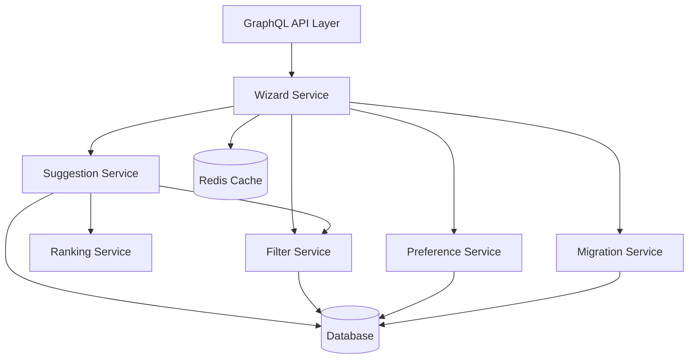

# Shopping List Migration Wizard - Enhanced Architecture & UX

**Date:** 2025-11-14
**Status:** Final Design - Backend Implementation Ready
**Focus:** Backend architecture to support wizard-based migration workflow

---

## Executive Summary

Based on your requirements, this document outlines an enhanced backend architecture for a **wizard-based shopping list migration system** that guides users through replacing expired items with current flyer products. The system prioritizes user control while minimizing decision fatigue through smart filtering and progressive disclosure.

---

## UX Workflow Analysis

### Your Current Vision
1. User has items in shopping list
2. Items are expired
3. System suggests to repopulate items from current week's flyers
4. System prompts user to a wizard-like form
5. User can select filters (shop, brand, cheapest, premium)
6. User sees 3-5 similar options, selects one
7. Items are repopulated as active in shopping list

### 🎯 Enhanced UX Workflow (Best Practices Applied)

#### **Stage 1: Smart Detection & Notification**
```
┌─────────────────────────────────────────────┐
│ 🔔 12 items need updating in "Weekly Shop"  │
│    7 expired • 3 better prices • 2 unavail. │
│                                              │
│    [Review Now]  [Remind Later]  [Dismiss]  │
└─────────────────────────────────────────────┘
```

**Improvements:**
- **Categorize** expired items (expired vs. better deals vs. unavailable)
- **Priority sorting** - Show most important updates first
- **Snooze option** - Reduce pressure on users

#### **Stage 2: Wizard Entry with Overview**
```
┌─────────────────────────────────────────────┐
│ Update Shopping List Items                   │
├─────────────────────────────────────────────┤
│ We found updates for 12 items:               │
│                                              │
│ • 7 products no longer in flyers            │
│ • 3 items with better prices available      │
│ • 2 items temporarily unavailable           │
│                                              │
│ Review takes ~2 minutes                      │
│                                              │
│ [Start Review] [Quick Auto-Update] [Cancel] │
└─────────────────────────────────────────────┘
```

**Key Features:**
- **Time expectation** setting (reduces anxiety)
- **Quick Auto-Update** option for users who trust the system
- **Clear categorization** of why updates are needed

#### **Stage 3: Global Filter Preferences (One-Time Setup)**
```
┌─────────────────────────────────────────────┐
│ Set Your Preferences (Step 1 of 13)          │
├─────────────────────────────────────────────┤
│ How should we find replacements?             │
│                                              │
│ Priority: [Cheapest ▼]                       │
│                                              │
│ Stores:                                      │
│ ☑ Maxima (12 items available)               │
│ ☑ Rimi (10 items available)                 │
│ ☐ Lidl (4 items available)                  │
│                                              │
│ Preferences:                                 │
│ ☑ Same brand when possible                  │
│ ☑ Similar size/quantity (±20%)              │
│ ☐ Premium products only                     │
│ ☐ Organic/eco alternatives                  │
│                                              │
│ [Apply to All] [Apply & Continue] [Skip]    │
└─────────────────────────────────────────────┘
```

**Improvements:**
- **Shows impact** - "(12 items available)" helps users understand filter consequences
- **Smart defaults** based on user history
- **"Apply to All"** for power users who want same settings for all items

#### **Stage 4: Item-by-Item Review (Progressive Disclosure)**
```
┌─────────────────────────────────────────────┐
│ Replacing: Milk 2.5% 1L Žemaitijos (Step 2) │
├─────────────────────────────────────────────┤
│ Original: €1.50 @ Maxima (expired)           │
│                                              │
│ ┌─ Recommended ─────────────────────────┐   │
│ │ 🥇 Milk 2.5% 1L Žemaitijos           │   │
│ │    €1.55 @ Maxima (+3%)               │   │
│ │    ✓ Same brand ✓ Same store         │   │
│ │    [Select This]                      │   │
│ └────────────────────────────────────────┘   │
│                                              │
│ ┌─ Alternative Options ─────────────────┐   │
│ │ ▾ Show 3 more options                 │   │
│ └────────────────────────────────────────┘   │
│                                              │
│ Progress: ■■□□□□□□□□□□ (2/13)                │
│                                              │
│ [← Previous] [Select & Next →] [Skip Item]  │
└─────────────────────────────────────────────┘
```

**When expanded:**
```
│ ┌─ Alternative Options ─────────────────┐   │
│ │ 2️⃣ Milk 2.5% 1L Rokiškio            │   │
│ │    €1.40 @ Rimi (-7%, different store)│   │
│ │    [Select]                           │   │
│ │                                        │   │
│ │ 3️⃣ Milk 3.2% 1L Žemaitijos          │   │
│ │    €1.60 @ Maxima (+7%, higher fat%) │   │
│ │    [Select]                           │   │
│ │                                        │   │
│ │ 4️⃣ Milk 2.5% 1L Dvaro               │   │
│ │    €1.35 @ Lidl (-10%, diff. brand)  │   │
│ │    [Select]                           │   │
│ │                                        │   │
│ │ [Adjust Filters] [Search Manually]    │   │
│ └────────────────────────────────────────┘   │
```

**Key UX Improvements:**
- **Progressive disclosure** - Show best option prominently, others on demand
- **Clear value props** - Each option shows WHY it's different (price %, store, brand)
- **Smart ranking** - Best match (considering filters) is pre-selected
- **Progress indicator** - Users know how much is left
- **Escape hatches** - "Skip Item" and "Search Manually" for edge cases

#### **Stage 5: Bulk Actions for Efficiency**
```
┌─────────────────────────────────────────────┐
│ Similar Items Detected                       │
├─────────────────────────────────────────────┤
│ We found 4 dairy products. Apply same       │
│ replacement strategy?                        │
│                                              │
│ • Butter 82% 200g → Same brand @ Maxima     │
│ • Cheese Džiugas → Same brand @ Maxima      │
│ • Yogurt Natural → Cheaper alt @ Rimi       │
│ • Sour Cream 20% → Same brand @ Maxima      │
│                                              │
│ [Apply to All Dairy] [Review Each] [Skip]   │
└─────────────────────────────────────────────┘
```

#### **Stage 6: Review & Confirm**
```
┌─────────────────────────────────────────────┐
│ Review Your Updates (Final Step)             │
├─────────────────────────────────────────────┤
│ Summary of Changes:                          │
│                                              │
│ 📍 Store Distribution:                       │
│ • Maxima: 8 items (€24.50)                  │
│ • Rimi: 3 items (€8.20)                     │
│ • Lidl: 1 item (€1.35)                      │
│                                              │
│ 💰 Price Impact:                             │
│ • Original total: €34.00                    │
│ • New total: €34.05 (+€0.05)               │
│ • Savings opportunity: Could save €2.30     │
│   by switching 3 items to Rimi [View]       │
│                                              │
│ ✓ 10 items updated successfully             │
│ ⚠ 2 items kept as-is (no good matches)     │
│                                              │
│ [Confirm Updates] [Go Back] [Cancel All]    │
└─────────────────────────────────────────────┘
```

---

## Backend Architecture for Wizard Workflow

### Core Services Architecture



### 1. Wizard Session Management

**Purpose:** Maintain wizard state across multiple API calls

```go
// internal/services/wizard/session.go

type WizardSession struct {
    ID              string                    `json:"id"`
    UserID          uuid.UUID                 `json:"user_id"`
    ShoppingListID  int64                     `json:"shopping_list_id"`

    // Items requiring migration
    PendingItems    []*MigrationCandidate     `json:"pending_items"`
    CompletedItems  []*MigrationDecision      `json:"completed_items"`
    SkippedItems    []int64                   `json:"skipped_items"`

    // Global filters for this session
    Filters         *MigrationFilters         `json:"filters"`

    // Progress tracking
    CurrentItemIndex int                      `json:"current_item_index"`
    TotalItems      int                       `json:"total_items"`

    // Session lifecycle
    CreatedAt       time.Time                 `json:"created_at"`
    UpdatedAt       time.Time                 `json:"updated_at"`
    ExpiresAt       time.Time                 `json:"expires_at"`
    State           WizardState               `json:"state"`
}

type WizardState string

const (
    WizardStateInitialized  WizardState = "initialized"
    WizardStateInProgress   WizardState = "in_progress"
    WizardStateReviewing    WizardState = "reviewing"
    WizardStateCompleted    WizardState = "completed"
    WizardStateCancelled    WizardState = "cancelled"
)

type MigrationCandidate struct {
    ItemID          int64                     `json:"item_id"`
    Item            *models.ShoppingListItem  `json:"item"`
    Reason          MigrationReason           `json:"reason"`
    Priority        int                       `json:"priority"` // For sorting
    Category        string                    `json:"category"` // For grouping
}

type MigrationDecision struct {
    ItemID              int64                 `json:"item_id"`
    SelectedProductID   *int64                `json:"selected_product_id"`
    SelectedMasterID    *int64                `json:"selected_master_id"`
    Action              DecisionAction        `json:"action"`
    Timestamp           time.Time             `json:"timestamp"`
}

type DecisionAction string

const (
    DecisionActionReplace   DecisionAction = "replace"
    DecisionActionKeep      DecisionAction = "keep"
    DecisionActionRemove    DecisionAction = "remove"
    DecisionActionManual    DecisionAction = "manual"
)
```

### 2. Dynamic Filter System

**Purpose:** Allow users to adjust filters per-item or globally

```go
// internal/services/wizard/filters.go

type MigrationFilters struct {
    // Store filters
    StoreIDs        []int                     `json:"store_ids"`
    StoreStrategy   StoreStrategy             `json:"store_strategy"`

    // Price filters
    PriceStrategy   PriceStrategy             `json:"price_strategy"`
    MaxPriceDelta   *float64                  `json:"max_price_delta_percent"`

    // Product filters
    BrandStrategy   BrandStrategy             `json:"brand_strategy"`
    SizeStrategy    SizeStrategy              `json:"size_strategy"`
    QualityTier     QualityTier               `json:"quality_tier"`

    // Special requirements
    RequireOrganic  bool                      `json:"require_organic"`
    RequireLocal    bool                      `json:"require_local"`
    ExcludeAllergens []string                 `json:"exclude_allergens"`
}

type StoreStrategy string
const (
    StoreStrategySameStore      StoreStrategy = "same_store"
    StoreStrategyAnyStore        StoreStrategy = "any_store"
    StoreStrategyPreferredStores StoreStrategy = "preferred_stores"
    StoreStrategyOptimalRoute    StoreStrategy = "optimal_route"
)

type PriceStrategy string
const (
    PriceStrategyCheapest       PriceStrategy = "cheapest"
    PriceStrategySimilar        PriceStrategy = "similar"
    PriceStrategyPremium        PriceStrategy = "premium"
    PriceStrategyBestValue      PriceStrategy = "best_value" // Price per unit
)

type BrandStrategy string
const (
    BrandStrategySameBrand      BrandStrategy = "same_brand"
    BrandStrategyAnyBrand        BrandStrategy = "any_brand"
    BrandStrategyPreferredBrands BrandStrategy = "preferred_brands"
    BrandStrategyPremiumBrands   BrandStrategy = "premium_brands"
)

type QualityTier string
const (
    QualityTierEconomy          QualityTier = "economy"
    QualityTierStandard         QualityTier = "standard"
    QualityTierPremium          QualityTier = "premium"
    QualityTierLuxury           QualityTier = "luxury"
)

// Service interface
type FilterService interface {
    // Create default filters based on user preferences
    GetDefaultFilters(ctx context.Context, userID uuid.UUID) (*MigrationFilters, error)

    // Validate and adjust filters based on available products
    ValidateFilters(ctx context.Context, filters *MigrationFilters, availableProducts []*models.Product) (*FilterValidationResult, error)

    // Apply filters to product candidates
    ApplyFilters(ctx context.Context, candidates []*models.ProductMaster, filters *MigrationFilters) ([]*models.ProductMaster, error)

    // Get filter impact preview
    PreviewFilterImpact(ctx context.Context, itemID int64, filters *MigrationFilters) (*FilterImpactPreview, error)
}

type FilterValidationResult struct {
    Valid           bool                      `json:"valid"`
    Warnings        []string                  `json:"warnings"`
    Adjustments     []string                  `json:"adjustments"`
    AvailableCount  int                       `json:"available_count"`
}

type FilterImpactPreview struct {
    TotalCandidates     int                   `json:"total_candidates"`
    AfterFiltering      int                   `json:"after_filtering"`
    ByStore            map[string]int         `json:"by_store"`
    PriceRange         *PriceRange            `json:"price_range"`
    BrandCount         int                    `json:"brand_count"`
}
```

### 3. Smart Suggestion Engine

```go
// internal/services/wizard/suggestions.go

type SuggestionEngine interface {
    // Get suggestions for a single item with filters
    GetSuggestions(
        ctx context.Context,
        item *models.ShoppingListItem,
        filters *MigrationFilters,
        limit int,
    ) (*SuggestionResult, error)

    // Get bulk suggestions for similar items
    GetBulkSuggestions(
        ctx context.Context,
        items []*models.ShoppingListItem,
        filters *MigrationFilters,
    ) (*BulkSuggestionResult, error)

    // Learn from user selection
    RecordSelection(
        ctx context.Context,
        userID uuid.UUID,
        originalItem *models.ShoppingListItem,
        selected *models.ProductMaster,
    ) error
}

type SuggestionResult struct {
    ItemID              int64                     `json:"item_id"`
    Suggestions         []*RankedSuggestion       `json:"suggestions"`
    RecommendedIndex    int                       `json:"recommended_index"`
    Explanation         string                    `json:"explanation"`
    AlternativeActions  []*AlternativeAction      `json:"alternative_actions"`
}

type RankedSuggestion struct {
    Rank                int                       `json:"rank"`
    ProductMaster       *models.ProductMaster     `json:"product_master"`
    ActiveProduct       *models.Product           `json:"active_product"`
    Store              *models.Store              `json:"store"`

    // Scoring breakdown
    Scores             *SuggestionScores          `json:"scores"`

    // Comparison to original
    Comparison         *ProductComparison         `json:"comparison"`

    // Why this suggestion
    Pros               []string                   `json:"pros"`
    Cons               []string                   `json:"cons"`
    Badge              *string                    `json:"badge"` // "Best Value", "Same Brand", etc.
}

type SuggestionScores struct {
    Overall            float64                    `json:"overall"`
    TextSimilarity     float64                    `json:"text_similarity"`
    PriceScore         float64                    `json:"price_score"`
    BrandMatch         float64                    `json:"brand_match"`
    SizeMatch          float64                    `json:"size_match"`
    StorePreference    float64                    `json:"store_preference"`
    UserPreference     float64                    `json:"user_preference"`
}

type ProductComparison struct {
    PriceDelta         float64                    `json:"price_delta"`
    PriceDeltaPercent  float64                    `json:"price_delta_percent"`
    SizeDelta          *string                    `json:"size_delta"`
    BrandChange        bool                       `json:"brand_change"`
    StoreChange        bool                       `json:"store_change"`
    QualityChange      *string                    `json:"quality_change"`
}

type AlternativeAction struct {
    Type               string                     `json:"type"` // "remove", "keep_as_text", "search_manual"
    Label              string                     `json:"label"`
    Description        string                     `json:"description"`
}
```

### 4. GraphQL API Schema

```graphql
# ============================================
# Wizard Types
# ============================================

type WizardSession {
  id: ID!
  shoppingList: ShoppingList!

  # Progress
  currentStep: Int!
  totalSteps: Int!
  state: WizardState!

  # Items
  pendingItems: [MigrationCandidate!]!
  completedItems: [MigrationDecision!]!
  skippedItems: [ShoppingListItem!]!

  # Current context
  currentItem: MigrationCandidate
  currentSuggestions: SuggestionResult

  # Filters
  globalFilters: MigrationFilters!

  # Summary
  estimatedTime: Int! # seconds
  priceImpact: PriceImpact
  storeDistribution: [StoreItemCount!]!
}

type MigrationCandidate {
  item: ShoppingListItem!
  reason: MigrationReason!
  priority: Int!
  category: String!
  similarItems: [ShoppingListItem!]! # For bulk actions
}

type SuggestionResult {
  item: ShoppingListItem!
  suggestions: [RankedSuggestion!]!
  recommendedIndex: Int!
  explanation: String!
  alternativeActions: [AlternativeAction!]!
}

type RankedSuggestion {
  rank: Int!
  productMaster: ProductMaster!
  activeProduct: Product!
  store: Store!

  # Scoring
  scores: SuggestionScores!
  comparison: ProductComparison!

  # User-friendly info
  pros: [String!]!
  cons: [String!]!
  badge: String
}

# ============================================
# Filter Types
# ============================================

input MigrationFiltersInput {
  # Stores
  storeIds: [ID!]
  storeStrategy: StoreStrategy

  # Price
  priceStrategy: PriceStrategy
  maxPriceDeltaPercent: Float

  # Product
  brandStrategy: BrandStrategy
  sizeStrategy: SizeStrategy
  qualityTier: QualityTier

  # Special
  requireOrganic: Boolean
  requireLocal: Boolean
  excludeAllergens: [String!]
}

enum StoreStrategy {
  SAME_STORE
  ANY_STORE
  PREFERRED_STORES
  OPTIMAL_ROUTE
}

enum PriceStrategy {
  CHEAPEST
  SIMILAR
  PREMIUM
  BEST_VALUE
}

# ============================================
# Queries
# ============================================

extend type Query {
  """
  Initialize a new wizard session for a shopping list
  """
  initializeWizard(
    shoppingListId: ID!
  ): WizardSession!

  """
  Get current wizard session
  """
  wizardSession(
    sessionId: ID!
  ): WizardSession

  """
  Preview how filters affect available products
  """
  previewFilterImpact(
    sessionId: ID!
    filters: MigrationFiltersInput!
  ): FilterImpactPreview!

  """
  Get user's saved filter preferences
  """
  getUserFilterPreferences: MigrationFilters!
}

# ============================================
# Mutations
# ============================================

extend type Mutation {
  """
  Start the wizard with initial setup
  """
  startWizard(
    shoppingListId: ID!
    filters: MigrationFiltersInput
  ): WizardSession!

  """
  Update global filters for the session
  """
  updateWizardFilters(
    sessionId: ID!
    filters: MigrationFiltersInput!
  ): WizardSession!

  """
  Get suggestions for current item (with optional filter override)
  """
  getItemSuggestions(
    sessionId: ID!
    itemId: ID!
    filters: MigrationFiltersInput
    limit: Int = 5
  ): SuggestionResult!

  """
  Make a decision for an item
  """
  makeItemDecision(
    sessionId: ID!
    itemId: ID!
    decision: ItemDecisionInput!
  ): WizardSession!

  """
  Apply same decision to multiple similar items
  """
  makeBulkDecision(
    sessionId: ID!
    itemIds: [ID!]!
    decision: ItemDecisionInput!
  ): WizardSession!

  """
  Move to next/previous item
  """
  navigateWizard(
    sessionId: ID!
    direction: NavigationDirection!
  ): WizardSession!

  """
  Complete wizard and apply all changes
  """
  completeWizard(
    sessionId: ID!
  ): WizardCompletionResult!

  """
  Cancel wizard session
  """
  cancelWizard(
    sessionId: ID!
  ): Boolean!

  """
  Quick auto-update with default settings
  """
  quickAutoUpdate(
    shoppingListId: ID!
    strategy: AutoUpdateStrategy = SMART
  ): QuickUpdateResult!

  """
  Save filter preferences for future use
  """
  saveFilterPreferences(
    filters: MigrationFiltersInput!
  ): Boolean!
}

input ItemDecisionInput {
  action: DecisionAction!
  selectedProductMasterId: ID
  selectedProductId: ID
  customNote: String
}

enum DecisionAction {
  REPLACE
  KEEP
  REMOVE
  MANUAL
}

enum NavigationDirection {
  NEXT
  PREVIOUS
  JUMP_TO
}

enum AutoUpdateStrategy {
  CONSERVATIVE  # High confidence only
  BALANCED      # Medium confidence
  AGGRESSIVE    # All suggestions
  SMART         # ML-based
}

type WizardCompletionResult {
  updatedItems: [ShoppingListItem!]!
  removedItems: [ID!]!
  unchangedItems: [ShoppingListItem!]!

  # Summary
  totalUpdated: Int!
  totalRemoved: Int!
  totalUnchanged: Int!

  # Impact
  priceImpact: PriceImpact!
  storeDistribution: [StoreItemCount!]!

  # Savings opportunity
  savingsOpportunity: SavingsOpportunity
}

type QuickUpdateResult {
  success: Boolean!
  updatedCount: Int!
  failedCount: Int!
  reviewRequired: [ShoppingListItem!]!
  summary: String!
}
```

### 5. Session Storage (Redis)

```go
// internal/services/wizard/storage.go

type SessionStorage interface {
    // Save session with TTL
    SaveSession(ctx context.Context, session *WizardSession) error

    // Get session by ID
    GetSession(ctx context.Context, sessionID string) (*WizardSession, error)

    // Update session state
    UpdateSession(ctx context.Context, sessionID string, updates map[string]interface{}) error

    // Delete session
    DeleteSession(ctx context.Context, sessionID string) error

    // Get all active sessions for a user
    GetUserSessions(ctx context.Context, userID uuid.UUID) ([]*WizardSession, error)
}

type RedisSessionStorage struct {
    client *redis.Client
    ttl    time.Duration // Default 30 minutes
}

func (s *RedisSessionStorage) SaveSession(ctx context.Context, session *WizardSession) error {
    data, err := json.Marshal(session)
    if err != nil {
        return err
    }

    key := fmt.Sprintf("wizard:session:%s", session.ID)
    userKey := fmt.Sprintf("wizard:user:%s:sessions", session.UserID)

    pipe := s.client.Pipeline()
    pipe.Set(ctx, key, data, s.ttl)
    pipe.SAdd(ctx, userKey, session.ID)
    pipe.Expire(ctx, userKey, s.ttl)

    _, err = pipe.Exec(ctx)
    return err
}
```

---

## Implementation Roadmap

### Phase 1: Core Infrastructure (Week 1)

**Backend Tasks:**
1. Database schema for wizard sessions and preferences
2. Redis integration for session storage
3. Basic wizard service with session management
4. Filter system implementation

**Deliverables:**
- `migration_wizard_sessions` table
- `user_filter_preferences` table
- `WizardService` with session CRUD
- `FilterService` with validation

### Phase 2: Suggestion Engine (Week 2)

**Backend Tasks:**
1. Enhanced ranking algorithm with filter support
2. Bulk suggestion optimization
3. Comparison and explanation generation
4. Alternative action suggestions

**Deliverables:**
- `SuggestionEngine` service
- Scoring algorithm with weights
- Batch processing for similar items

### Phase 3: GraphQL API (Week 3)

**Backend Tasks:**
1. Wizard session mutations
2. Filter preview queries
3. Navigation and state management
4. Completion and rollback handlers

**Deliverables:**
- Complete GraphQL schema
- All resolvers implemented
- Session lifecycle management

### Phase 4: Optimization & Intelligence (Week 4)

**Backend Tasks:**
1. Quick auto-update strategies
2. Learning from user selections
3. Performance optimization
4. Error recovery and resilience

**Deliverables:**
- ML preference tracking
- Caching layer
- Batch operations
- Monitoring and metrics

---

## API Usage Examples

### 1. Initialize Wizard
```graphql
mutation StartMigrationWizard {
  startWizard(
    shoppingListId: "123"
    filters: {
      storeStrategy: PREFERRED_STORES
      storeIds: ["1", "2"]
      priceStrategy: BALANCED
      brandStrategy: SAME_BRAND
    }
  ) {
    id
    currentStep
    totalSteps
    pendingItems {
      item {
        id
        description
      }
      reason
    }
    estimatedTime
  }
}
```

### 2. Get Suggestions for Current Item
```graphql
query GetSuggestions {
  getItemSuggestions(
    sessionId: "wizard-abc-123"
    itemId: "456"
    limit: 5
  ) {
    suggestions {
      rank
      productMaster {
        name
      }
      activeProduct {
        price
      }
      store {
        name
      }
      comparison {
        priceDeltaPercent
      }
      pros
      cons
      badge
    }
    recommendedIndex
    explanation
  }
}
```

### 3. Make Decision
```graphql
mutation SelectReplacement {
  makeItemDecision(
    sessionId: "wizard-abc-123"
    itemId: "456"
    decision: {
      action: REPLACE
      selectedProductMasterId: "789"
    }
  ) {
    currentStep
    state
    currentItem {
      item {
        description
      }
    }
  }
}
```

### 4. Complete Wizard
```graphql
mutation FinishWizard {
  completeWizard(sessionId: "wizard-abc-123") {
    updatedItems {
      id
      description
      productMaster {
        name
      }
    }
    totalUpdated
    priceImpact {
      originalTotal
      newTotal
      difference
    }
    savingsOpportunity {
      potentialSavings
      suggestion
    }
  }
}
```

---

## Performance Considerations

### Caching Strategy

```go
// Cache layers
type CacheKeys struct {
    // Active flyer products by store (1 hour TTL)
    ActiveProducts   string = "active_products:store:%d"

    // Product master candidates (15 min TTL)
    MasterCandidates string = "masters:category:%s"

    // User preferences (24 hour TTL)
    UserPreferences  string = "user:preferences:%s"

    // Wizard session (30 min TTL)
    WizardSession    string = "wizard:session:%s"
}
```

### Database Optimization

```sql
-- Index for fast expired item detection
CREATE INDEX idx_shopping_items_expired
ON shopping_list_items(shopping_list_id, linked_product_id)
WHERE product_master_id IS NULL;

-- Index for active product lookup
CREATE INDEX idx_products_active_by_master
ON products(product_master_id, flyer_id)
WHERE product_master_id IS NOT NULL;

-- Composite index for filtering
CREATE INDEX idx_products_filter_search
ON products(store_id, price, brand, category)
WHERE flyer_id IN (SELECT id FROM flyers WHERE status = 'active');
```

### Batch Processing

```go
// Process similar items together
func (s *SuggestionEngine) processSimilarItems(
    ctx context.Context,
    items []*models.ShoppingListItem,
) ([]*BulkSuggestion, error) {
    // Group by category
    categories := groupByCategory(items)

    // Fetch all candidates at once
    allCandidates := s.fetchCandidatesForCategories(ctx, categories)

    // Process in parallel
    results := make(chan *BulkSuggestion, len(categories))
    for cat, items := range categories {
        go func(c string, i []*models.ShoppingListItem) {
            suggestions := s.processCategory(ctx, c, i, allCandidates[c])
            results <- suggestions
        }(cat, items)
    }

    // Collect results
    // ...
}
```

---

## Error Handling & Recovery

### Session Recovery

```go
type WizardRecovery struct {
    // Auto-save progress every N decisions
    AutoSaveInterval int = 3

    // Recovery strategies
    RecoverSession(ctx context.Context, userID uuid.UUID) (*WizardSession, error)
    SaveCheckpoint(ctx context.Context, session *WizardSession) error
    RollbackToCheckpoint(ctx context.Context, sessionID string) error
}
```

### Graceful Degradation

```go
// If no good suggestions found
type FallbackStrategy interface {
    // Try relaxing filters
    RelaxFilters(filters *MigrationFilters) *MigrationFilters

    // Expand search to more stores
    ExpandStoreSearch(currentStores []int) []int

    // Suggest manual search
    GetManualSearchTerms(item *ShoppingListItem) []string
}
```

---

## Success Metrics

### Key Performance Indicators

| Metric | Target | Measurement |
|--------|--------|-------------|
| **Wizard Completion Rate** | >70% | `completed / started` |
| **Average Time per Item** | <15 seconds | `total_time / items_processed` |
| **Suggestion Accept Rate** | >80% | `replaced / (replaced + kept + removed)` |
| **Quick Update Usage** | >30% | `quick_updates / total_updates` |
| **Filter Adjustment Rate** | <20% | Shows if defaults are good |
| **Session Timeout Rate** | <10% | `timed_out / started` |

### User Satisfaction Signals

- **Positive Signals:**
  - High completion rate
  - Low time per decision
  - Rare filter adjustments
  - Use of bulk actions

- **Negative Signals:**
  - High skip rate
  - Frequent "search manually"
  - Session abandonment
  - Immediate undo after completion

---

## Advanced Features (Future)

### 1. Smart Grouping
```go
// Automatically detect and group similar items
type SmartGrouper interface {
    // Group by product category
    GroupByCategory(items []*ShoppingListItem) map[string][]*ShoppingListItem

    // Group by store optimization
    GroupByOptimalStore(items []*ShoppingListItem) map[int][]*ShoppingListItem

    // Group by replacement strategy
    GroupByStrategy(items []*ShoppingListItem) map[ReplacementStrategy][]*ShoppingListItem
}
```

### 2. Predictive Suggestions
```go
// Predict what user will select based on history
type PredictiveEngine interface {
    // Predict selection with confidence
    PredictSelection(
        user *User,
        item *ShoppingListItem,
        suggestions []*RankedSuggestion,
    ) (predictedIndex int, confidence float64)

    // Pre-select high confidence predictions
    AutoSelectHighConfidence(threshold float64) bool
}
```

### 3. Voice/Conversational Interface
```graphql
type ConversationalWizard {
  # "Find me the cheapest milk"
  processNaturalLanguage(
    sessionId: ID!
    command: String!
  ): WizardResponse!

  # "Accept all dairy products"
  processBulkCommand(
    sessionId: ID!
    command: String!
  ): BulkActionResult!
}
```

---

## Security Considerations

### Rate Limiting
```go
// Prevent abuse
type RateLimits struct {
    WizardSessionsPerHour    int = 10
    SuggestionsPerMinute     int = 30
    FilterChangesPerSession  int = 20
}
```

### Data Privacy
```go
// Ensure users can only access their own data
func (s *WizardService) validateAccess(
    ctx context.Context,
    userID uuid.UUID,
    sessionID string,
) error {
    session, err := s.storage.GetSession(ctx, sessionID)
    if err != nil {
        return err
    }

    if session.UserID != userID {
        return ErrUnauthorized
    }

    return nil
}
```

---

## Conclusion

This enhanced architecture provides:

1. **Better UX through progressive disclosure** - Users see what they need, when they need it
2. **Flexible filtering system** - Accommodates different user preferences and shopping patterns
3. **Efficient batch processing** - Reduces repetitive decisions for similar items
4. **Smart defaults with escape hatches** - Works well automatically but allows manual control
5. **Session management** - Maintains state across the multi-step wizard
6. **Performance optimization** - Caching, batching, and smart queries for responsive experience

The wizard approach significantly improves upon the original vision by:
- Reducing decision fatigue through smart grouping
- Providing context and explanations for suggestions
- Allowing both detailed control and quick actions
- Learning from user behavior for future improvements

Ready to begin implementation with Phase 1!