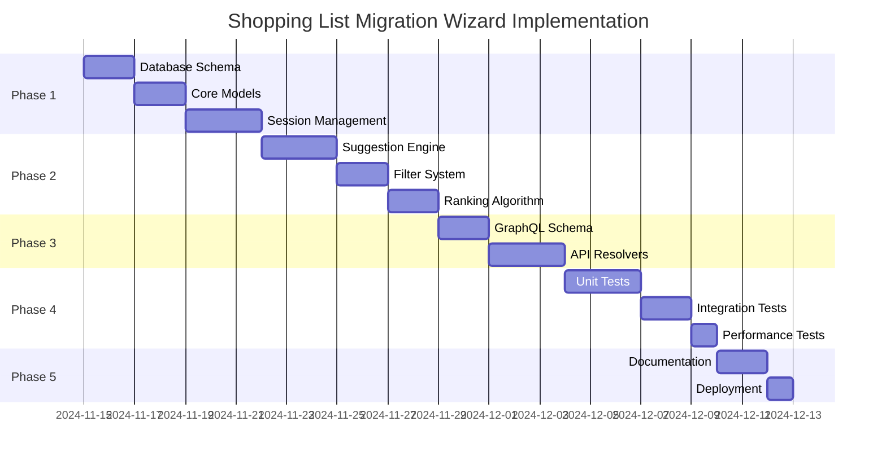

# Technical Specification: Shopping List Migration Wizard

**Document Version:** 1.0
**Date:** November 14, 2025
**Status:** Final
**Feature Name:** Shopping List Item Migration Wizard
**Epic:** Shopping List Management
**Priority:** High

---

## Table of Contents

1. [Executive Summary](#1-executive-summary)
2. [Functional Requirements](#2-functional-requirements)
3. [Technical Architecture](#3-technical-architecture)
4. [Data Models](#4-data-models)
5. [API Specifications](#5-api-specifications)
6. [Business Logic](#6-business-logic)
7. [Performance Requirements](#7-performance-requirements)
8. [Security Requirements](#8-security-requirements)
9. [Testing Requirements](#9-testing-requirements)
10. [Implementation Plan](#10-implementation-plan)
11. [Acceptance Criteria](#11-acceptance-criteria)
12. [Appendices](#12-appendices)

---

## 1. Executive Summary

### 1.1 Purpose

This specification defines the technical implementation of a wizard-based shopping list migration system that helps users replace expired flyer products with currently available alternatives from active flyers.

### 1.2 Problem Statement

- **Current State:** When flyer products expire, shopping list items become orphaned, requiring manual updates
- **User Impact:** Users must manually search for replacements, leading to abandoned lists and poor user experience
- **Business Impact:** Reduced engagement with shopping lists feature, lower flyer product discovery

### 1.3 Solution Overview

A guided wizard interface that:
- Detects expired/unavailable items automatically
- Presents filtered, ranked alternatives from current flyers
- Allows bulk actions for similar items
- Maintains user preferences for future migrations

### 1.4 Success Metrics

| Metric | Target | Measurement Method |
|--------|--------|-------------------|
| Wizard Completion Rate | >70% | `completed_sessions / initiated_sessions` |
| User Satisfaction | >4.0/5.0 | Post-wizard survey |
| Average Decision Time | <15 sec/item | Session analytics |
| List Abandonment Rate | <10% decrease | Compare pre/post implementation |

---

## 2. Functional Requirements

### 2.1 Core Features

#### FR-001: Expired Item Detection
**Priority:** P0 (Critical)
```
GIVEN a shopping list with items linked to flyer products
WHEN those flyer products expire or become unavailable
THEN the system shall identify these items for migration
AND categorize them by reason (expired, unavailable, better_price_available)
```

#### FR-002: Migration Wizard Initiation
**Priority:** P0 (Critical)
```
GIVEN items requiring migration exist
WHEN user accesses their shopping list
THEN system shall notify user of migration opportunities
AND provide options to: start_wizard, auto_update, dismiss
```

#### FR-003: Filter Configuration
**Priority:** P0 (Critical)
```
GIVEN wizard is initiated
WHEN user reaches filter configuration step
THEN system shall allow configuration of:
  - Store preferences (single, multiple, any)
  - Price strategy (cheapest, similar, premium)
  - Brand preferences (same, any, preferred)
  - Quality tier (economy, standard, premium)
AND apply these filters to all suggestions
```

#### FR-004: Product Suggestions
**Priority:** P0 (Critical)
```
GIVEN an item needs migration
WHEN system generates suggestions
THEN system shall:
  - Return 3-5 alternatives from active flyers
  - Rank by composite score (similarity, price, preferences)
  - Include comparison data (price delta, size difference)
  - Provide explanation for each suggestion
```

#### FR-005: Decision Recording
**Priority:** P0 (Critical)
```
GIVEN user reviews a suggestion
WHEN user makes a decision
THEN system shall support actions:
  - Replace with selected alternative
  - Keep item as-is (unlinked)
  - Remove item from list
  - Search manually for alternative
AND record decision for learning
```

#### FR-006: Bulk Actions
**Priority:** P1 (High)
```
GIVEN multiple similar items need migration
WHEN system detects similarity (category, brand, store)
THEN system shall offer bulk action
AND apply same decision to all similar items
```

#### FR-007: Session Persistence
**Priority:** P1 (High)
```
GIVEN user is in migration wizard
WHEN session is interrupted
THEN system shall maintain session state for 30 minutes
AND allow user to resume from last position
```

#### FR-008: Quick Auto-Update
**Priority:** P1 (High)
```
GIVEN user wants automatic migration
WHEN user selects "Quick Auto-Update"
THEN system shall:
  - Apply high-confidence replacements (>0.90 similarity)
  - Use user's default preferences
  - Complete in <5 seconds
  - Provide summary of changes
```

### 2.2 Non-Functional Requirements

#### NFR-001: Performance
- Wizard initialization: <500ms
- Suggestion generation: <1000ms per item
- Filter application: <200ms
- Session save: <100ms

#### NFR-002: Scalability
- Support 10,000 concurrent wizard sessions
- Handle shopping lists with up to 100 items
- Process up to 1,000 migration requests/second

#### NFR-003: Availability
- 99.9% uptime for wizard service
- Graceful degradation if suggestion service fails
- Session recovery from cache failures

#### NFR-004: Usability
- Mobile-first responsive design
- Accessible (WCAG 2.1 AA compliant)
- Support for 3 languages (EN, LT, RU)

---

## 3. Technical Architecture

### 3.1 System Architecture

```
┌─────────────────────────────────────────────────────────────┐
│                      Frontend Layer                         │
│  ┌─────────────┐  ┌──────────────┐  ┌─────────────────┐  │
│  │  Mobile App │  │   Web App    │  │   Admin Panel   │  │
│  └─────────────┘  └──────────────┘  └─────────────────┘  │
└─────────────────────────────────────────────────────────────┘
                              │
                              ▼
┌─────────────────────────────────────────────────────────────┐
│                    GraphQL API Gateway                      │
│  ┌──────────────────────────────────────────────────────┐ │
│  │  Schema: Wizard, Suggestions, Filters, Decisions     │ │
│  └──────────────────────────────────────────────────────┘ │
└─────────────────────────────────────────────────────────────┘
                              │
                              ▼
┌─────────────────────────────────────────────────────────────┐
│                     Service Layer                           │
│  ┌──────────────┐  ┌─────────────┐  ┌─────────────────┐  │
│  │Wizard Service│  │ Suggestion  │  │ Filter Service  │  │
│  │              │  │   Engine    │  │                 │  │
│  └──────────────┘  └─────────────┘  └─────────────────┘  │
│  ┌──────────────┐  ┌─────────────┐  ┌─────────────────┐  │
│  │  Migration   │  │  Ranking    │  │  Preference     │  │
│  │   Service    │  │   Service   │  │    Service      │  │
│  └──────────────┘  └─────────────┘  └─────────────────┘  │
└─────────────────────────────────────────────────────────────┘
                              │
                              ▼
┌─────────────────────────────────────────────────────────────┐
│                      Data Layer                             │
│  ┌──────────────┐  ┌─────────────┐  ┌─────────────────┐  │
│  │  PostgreSQL  │  │    Redis    │  │  Elasticsearch  │  │
│  │   (Primary)  │  │  (Sessions) │  │   (Search)      │  │
│  └──────────────┘  └─────────────┘  └─────────────────┘  │
└─────────────────────────────────────────────────────────────┘
```

### 3.2 Service Responsibilities

| Service | Responsibilities | Dependencies |
|---------|-----------------|--------------|
| **Wizard Service** | Session management, state transitions, progress tracking | Redis, PostgreSQL |
| **Suggestion Engine** | Generate product alternatives, apply ML ranking | PostgreSQL, Elasticsearch |
| **Filter Service** | Validate filters, apply constraints, preview impact | PostgreSQL |
| **Migration Service** | Apply decisions, update shopping lists, record history | PostgreSQL |
| **Ranking Service** | Calculate composite scores, apply weights | Configuration |
| **Preference Service** | Store/retrieve user preferences, learning | PostgreSQL, Redis |

### 3.3 Technology Stack

- **Language:** Go 1.21+
- **Framework:** Gin (HTTP), gqlgen (GraphQL)
- **Database:** PostgreSQL 15+ with PostGIS
- **Cache:** Redis 7+
- **Search:** Elasticsearch 8+ (optional, for advanced search)
- **Message Queue:** RabbitMQ (for async processing)
- **Monitoring:** Prometheus + Grafana
- **Logging:** Structured logging with slog
- **Testing:** Go testing + Testify + Mockery

---

## 4. Data Models

### 4.1 Database Schema

#### Table: wizard_sessions

```sql
CREATE TABLE wizard_sessions (
    id UUID PRIMARY KEY DEFAULT gen_random_uuid(),
    user_id UUID NOT NULL REFERENCES users(id),
    shopping_list_id BIGINT NOT NULL REFERENCES shopping_lists(id),

    -- State
    state VARCHAR(50) NOT NULL DEFAULT 'initialized',
    current_item_index INT NOT NULL DEFAULT 0,
    total_items INT NOT NULL,

    -- Filters (JSONB for flexibility)
    global_filters JSONB NOT NULL DEFAULT '{}',

    -- Progress tracking
    pending_items JSONB NOT NULL DEFAULT '[]',
    completed_items JSONB NOT NULL DEFAULT '[]',
    skipped_items BIGINT[] DEFAULT '{}',

    -- Timestamps
    created_at TIMESTAMP NOT NULL DEFAULT NOW(),
    updated_at TIMESTAMP NOT NULL DEFAULT NOW(),
    expires_at TIMESTAMP NOT NULL DEFAULT NOW() + INTERVAL '30 minutes',
    completed_at TIMESTAMP,

    -- Indexes
    INDEX idx_wizard_sessions_user_id (user_id),
    INDEX idx_wizard_sessions_state (state),
    INDEX idx_wizard_sessions_expires (expires_at) WHERE state != 'completed'
);
```

#### Table: migration_suggestions

```sql
CREATE TABLE migration_suggestions (
    id BIGSERIAL PRIMARY KEY,
    wizard_session_id UUID REFERENCES wizard_sessions(id) ON DELETE CASCADE,
    shopping_list_item_id BIGINT NOT NULL REFERENCES shopping_list_items(id),

    -- Original product info
    original_product_id BIGINT REFERENCES products(id),
    original_product_master_id BIGINT REFERENCES product_masters(id),

    -- Suggestions (array of product suggestions)
    suggestions JSONB NOT NULL,

    -- Decision
    selected_product_master_id BIGINT REFERENCES product_masters(id),
    selected_product_id BIGINT REFERENCES products(id),
    decision_action VARCHAR(50), -- 'replace', 'keep', 'remove', 'manual'
    decision_timestamp TIMESTAMP,

    -- Metadata
    migration_reason VARCHAR(100) NOT NULL,
    confidence_score FLOAT,
    ranking_version VARCHAR(20),

    -- Timestamps
    created_at TIMESTAMP NOT NULL DEFAULT NOW(),

    -- Indexes
    INDEX idx_migration_suggestions_session (wizard_session_id),
    INDEX idx_migration_suggestions_item (shopping_list_item_id),
    INDEX idx_migration_suggestions_decision (decision_action)
);
```

#### Table: user_migration_preferences

```sql
CREATE TABLE user_migration_preferences (
    user_id UUID PRIMARY KEY REFERENCES users(id),

    -- Default filters
    default_filters JSONB NOT NULL DEFAULT '{}',

    -- Learned preferences
    brand_preferences JSONB DEFAULT '{}',
    store_preferences JSONB DEFAULT '{}',
    price_sensitivity FLOAT DEFAULT 0.5, -- 0=price insensitive, 1=very sensitive
    quality_preference FLOAT DEFAULT 0.5, -- 0=economy, 1=premium

    -- Behavioral stats
    total_migrations INT DEFAULT 0,
    auto_accept_rate FLOAT DEFAULT 0,
    avg_decision_time_seconds FLOAT,
    preferred_suggestion_count INT DEFAULT 5,

    -- Settings
    enable_auto_migration BOOLEAN DEFAULT false,
    auto_migration_confidence_threshold FLOAT DEFAULT 0.90,
    notification_preferences JSONB DEFAULT '{"push": true, "email": false}',

    -- Timestamps
    created_at TIMESTAMP NOT NULL DEFAULT NOW(),
    updated_at TIMESTAMP NOT NULL DEFAULT NOW()
);
```

### 4.2 Domain Models (Go)

```go
// internal/models/wizard.go

package models

import (
    "time"
    "github.com/google/uuid"
    "github.com/uptrace/bun"
)

// WizardSession represents an active migration wizard session
type WizardSession struct {
    bun.BaseModel `bun:"table:wizard_sessions,alias:ws"`

    ID              uuid.UUID              `bun:"id,pk,type:uuid,default:gen_random_uuid()"`
    UserID          uuid.UUID              `bun:"user_id,notnull"`
    ShoppingListID  int64                  `bun:"shopping_list_id,notnull"`

    // State management
    State           WizardState            `bun:"state,notnull"`
    CurrentItemIndex int                   `bun:"current_item_index,notnull,default:0"`
    TotalItems      int                    `bun:"total_items,notnull"`

    // Configuration
    GlobalFilters   *MigrationFilters      `bun:"global_filters,type:jsonb"`

    // Progress tracking
    PendingItems    []MigrationCandidate   `bun:"pending_items,type:jsonb"`
    CompletedItems  []MigrationDecision    `bun:"completed_items,type:jsonb"`
    SkippedItems    []int64                `bun:"skipped_items,array"`

    // Timestamps
    CreatedAt       time.Time              `bun:"created_at,notnull,default:current_timestamp"`
    UpdatedAt       time.Time              `bun:"updated_at,notnull,default:current_timestamp"`
    ExpiresAt       time.Time              `bun:"expires_at,notnull"`
    CompletedAt     *time.Time             `bun:"completed_at"`

    // Relations
    User            *User                  `bun:"rel:belongs-to,join:user_id=id"`
    ShoppingList    *ShoppingList          `bun:"rel:belongs-to,join:shopping_list_id=id"`
}

type WizardState string

const (
    WizardStateInitialized  WizardState = "initialized"
    WizardStateInProgress   WizardState = "in_progress"
    WizardStateReviewing    WizardState = "reviewing"
    WizardStateCompleted    WizardState = "completed"
    WizardStateCancelled    WizardState = "cancelled"
    WizardStateExpired      WizardState = "expired"
)

// MigrationFilters defines filtering criteria for suggestions
type MigrationFilters struct {
    // Store preferences
    StoreIDs        []int         `json:"store_ids,omitempty"`
    StoreStrategy   StoreStrategy `json:"store_strategy"`

    // Price preferences
    PriceStrategy   PriceStrategy `json:"price_strategy"`
    MaxPriceDelta   *float64      `json:"max_price_delta_percent,omitempty"`

    // Product preferences
    BrandStrategy   BrandStrategy `json:"brand_strategy"`
    SizeStrategy    SizeStrategy  `json:"size_strategy"`
    QualityTier     QualityTier   `json:"quality_tier"`

    // Special requirements
    RequireOrganic  bool          `json:"require_organic"`
    RequireLocal    bool          `json:"require_local"`
    ExcludeAllergens []string     `json:"exclude_allergens,omitempty"`
}

// MigrationCandidate represents an item that needs migration
type MigrationCandidate struct {
    ItemID          int64         `json:"item_id"`
    Reason          MigrationReason `json:"reason"`
    Priority        int           `json:"priority"`
    Category        string        `json:"category"`
    OriginalPrice   *float64      `json:"original_price,omitempty"`
    ExpirationDate  *time.Time    `json:"expiration_date,omitempty"`
}

// MigrationDecision records a user's decision for an item
type MigrationDecision struct {
    ItemID              int64         `json:"item_id"`
    Action              DecisionAction `json:"action"`
    SelectedProductID   *int64        `json:"selected_product_id,omitempty"`
    SelectedMasterID    *int64        `json:"selected_master_id,omitempty"`
    DecisionTime        time.Time     `json:"decision_time"`
    TimeToDecision      int           `json:"time_to_decision_seconds"`
}

// Enums for filter strategies
type StoreStrategy string
const (
    StoreStrategySameStore      StoreStrategy = "same_store"
    StoreStrategyAnyStore        StoreStrategy = "any_store"
    StoreStrategyPreferredStores StoreStrategy = "preferred_stores"
    StoreStrategyOptimalRoute    StoreStrategy = "optimal_route"
)

type PriceStrategy string
const (
    PriceStrategyCheapest   PriceStrategy = "cheapest"
    PriceStrategySimilar    PriceStrategy = "similar"
    PriceStrategyPremium    PriceStrategy = "premium"
    PriceStrategyBestValue  PriceStrategy = "best_value"
)

type BrandStrategy string
const (
    BrandStrategySameBrand      BrandStrategy = "same_brand"
    BrandStrategyAnyBrand        BrandStrategy = "any_brand"
    BrandStrategyPreferredBrands BrandStrategy = "preferred_brands"
)

type MigrationReason string
const (
    MigrationReasonExpired      MigrationReason = "product_expired"
    MigrationReasonUnavailable  MigrationReason = "product_unavailable"
    MigrationReasonBetterPrice  MigrationReason = "better_price_available"
    MigrationReasonManual       MigrationReason = "manual_trigger"
)

type DecisionAction string
const (
    DecisionActionReplace   DecisionAction = "replace"
    DecisionActionKeep      DecisionAction = "keep"
    DecisionActionRemove    DecisionAction = "remove"
    DecisionActionManual    DecisionAction = "manual"
    DecisionActionSkip      DecisionAction = "skip"
)
```

---

## 5. API Specifications

### 5.1 GraphQL Schema

```graphql
# ==========================================
# WIZARD MANAGEMENT
# ==========================================

type Query {
  # Initialize wizard for a shopping list
  initializeWizard(shoppingListId: ID!): WizardInitResult!

  # Get active wizard session
  getWizardSession(sessionId: ID!): WizardSession

  # Get user's filter preferences
  getUserPreferences: UserMigrationPreferences!

  # Preview filter impact
  previewFilterImpact(
    sessionId: ID!
    filters: MigrationFiltersInput!
    itemId: ID
  ): FilterImpactPreview!
}

type Mutation {
  # Start wizard with configuration
  startWizard(input: StartWizardInput!): WizardSession!

  # Update wizard filters
  updateWizardFilters(
    sessionId: ID!
    filters: MigrationFiltersInput!
    applyToAll: Boolean = true
  ): WizardSession!

  # Get suggestions for an item
  getItemSuggestions(
    sessionId: ID!
    itemId: ID!
    filters: MigrationFiltersInput
  ): SuggestionResult!

  # Record user decision
  recordDecision(
    sessionId: ID!
    itemId: ID!
    decision: DecisionInput!
  ): WizardSession!

  # Apply bulk decision
  applyBulkDecision(
    sessionId: ID!
    itemIds: [ID!]!
    decision: DecisionInput!
  ): BulkDecisionResult!

  # Navigate wizard
  navigateWizard(
    sessionId: ID!
    action: NavigationAction!
  ): WizardSession!

  # Complete wizard
  completeWizard(sessionId: ID!): WizardCompletionResult!

  # Cancel wizard
  cancelWizard(sessionId: ID!): Boolean!

  # Quick auto-update
  quickAutoUpdate(
    shoppingListId: ID!
    strategy: AutoUpdateStrategy = BALANCED
  ): QuickUpdateResult!

  # Save user preferences
  saveUserPreferences(
    preferences: UserPreferencesInput!
  ): UserMigrationPreferences!
}

# ==========================================
# INPUT TYPES
# ==========================================

input StartWizardInput {
  shoppingListId: ID!
  filters: MigrationFiltersInput
  includeCategories: [MigrationReason!]
  autoApplyHighConfidence: Boolean = false
}

input MigrationFiltersInput {
  storeIds: [ID!]
  storeStrategy: StoreStrategy
  priceStrategy: PriceStrategy
  maxPriceDeltaPercent: Float
  brandStrategy: BrandStrategy
  sizeStrategy: SizeStrategy
  qualityTier: QualityTier
  requireOrganic: Boolean
  requireLocal: Boolean
  excludeAllergens: [String!]
}

input DecisionInput {
  action: DecisionAction!
  selectedProductMasterId: ID
  selectedProductId: ID
  note: String
}

# ==========================================
# RESPONSE TYPES
# ==========================================

type WizardSession {
  id: ID!
  state: WizardState!

  # Progress
  currentItemIndex: Int!
  totalItems: Int!
  completedCount: Int!
  remainingCount: Int!
  progressPercent: Float!

  # Current context
  currentItem: MigrationCandidate

  # Items
  pendingItems: [MigrationCandidate!]!
  completedItems: [CompletedMigration!]!
  skippedItems: [ShoppingListItem!]!

  # Configuration
  globalFilters: MigrationFilters!

  # Time estimates
  estimatedTimeRemaining: Int! # seconds
  averageDecisionTime: Float! # seconds

  # Summary
  priceImpact: PriceImpactSummary
  storeDistribution: [StoreDistribution!]!
}

type SuggestionResult {
  itemId: ID!
  item: ShoppingListItem!
  suggestions: [ProductSuggestion!]!
  recommendedIndex: Int
  explanations: [String!]!
  alternativeActions: [AlternativeAction!]!
  noSuggestionsReason: String
}

type ProductSuggestion {
  rank: Int!
  productMaster: ProductMaster!
  activeProduct: Product!
  store: Store!

  # Scoring
  scores: SuggestionScores!

  # Comparison
  priceDelta: Float!
  priceDeltaPercent: Float!
  sizeDelta: String
  brandMatch: Boolean!
  storeMatch: Boolean!

  # User guidance
  pros: [String!]!
  cons: [String!]!
  badges: [String!]!
  confidence: Float!
}

type WizardCompletionResult {
  success: Boolean!

  # Changes applied
  updatedItems: [ShoppingListItem!]!
  removedItems: [ID!]!
  unchangedItems: [ShoppingListItem!]!

  # Summary statistics
  totalProcessed: Int!
  totalUpdated: Int!
  totalRemoved: Int!
  totalUnchanged: Int!

  # Impact analysis
  originalTotalPrice: Float!
  newTotalPrice: Float!
  totalSavings: Float!

  # Store optimization
  storeDistribution: [StoreDistribution!]!
  optimalStoreRoute: [Store!]

  # Learning captured
  preferencesUpdated: Boolean!
  decisionsRecorded: Int!
}
```

### 5.2 REST API Endpoints (Alternative)

While GraphQL is preferred, these REST endpoints provide alternative access:

#### POST /api/v1/wizard/initialize
```json
Request:
{
  "shopping_list_id": 123,
  "include_expired": true,
  "include_unavailable": true,
  "include_better_prices": false
}

Response:
{
  "wizard_session_id": "uuid",
  "items_to_migrate": 12,
  "estimated_time_seconds": 180,
  "categories": ["expired", "unavailable"]
}
```

#### POST /api/v1/wizard/{session_id}/suggestions
```json
Request:
{
  "item_id": 456,
  "limit": 5,
  "filters": {
    "store_strategy": "same_store",
    "price_strategy": "similar"
  }
}

Response:
{
  "suggestions": [
    {
      "rank": 1,
      "product_id": 789,
      "product_name": "Milk 2.5% 1L",
      "price": 1.55,
      "store": "Maxima",
      "confidence": 0.95,
      "pros": ["Same brand", "Same store"],
      "cons": ["5% more expensive"]
    }
  ]
}
```

---

## 6. Business Logic

### 6.1 Suggestion Ranking Algorithm

```go
// internal/services/ranking/algorithm.go

type RankingAlgorithm struct {
    weights RankingWeights
}

type RankingWeights struct {
    TextSimilarity   float64 // Default: 0.30
    PriceScore       float64 // Default: 0.25
    BrandMatch       float64 // Default: 0.20
    StorePreference  float64 // Default: 0.15
    SizeMatch        float64 // Default: 0.10
}

func (r *RankingAlgorithm) CalculateScore(
    original *models.ShoppingListItem,
    candidate *models.ProductMaster,
    context *RankingContext,
) float64 {
    score := 0.0

    // Text similarity (using trigram matching)
    textScore := calculateTextSimilarity(
        original.NormalizedDescription,
        candidate.NormalizedName,
    )
    score += textScore * r.weights.TextSimilarity

    // Price score (inverse of price delta percentage)
    if original.EstimatedPrice != nil && candidate.CurrentPrice != nil {
        priceDelta := math.Abs(*candidate.CurrentPrice - *original.EstimatedPrice)
        priceScore := 1.0 - (priceDelta / *original.EstimatedPrice)
        score += math.Max(0, priceScore) * r.weights.PriceScore
    }

    // Brand matching
    if original.Brand == candidate.Brand {
        score += 1.0 * r.weights.BrandMatch
    }

    // Store preference
    if context.PreferredStores != nil {
        for _, storeID := range context.PreferredStores {
            if candidate.StoreID == storeID {
                score += 1.0 * r.weights.StorePreference
                break
            }
        }
    }

    // Size/quantity matching
    sizeScore := calculateSizeMatch(original.Quantity, candidate.PackageSize)
    score += sizeScore * r.weights.SizeMatch

    return math.Min(1.0, score) // Normalize to 0-1
}

func calculateTextSimilarity(s1, s2 string) float64 {
    // Implement trigram similarity
    trigrams1 := extractTrigrams(s1)
    trigrams2 := extractTrigrams(s2)

    intersection := 0
    for trigram := range trigrams1 {
        if trigrams2[trigram] {
            intersection++
        }
    }

    union := len(trigrams1) + len(trigrams2) - intersection
    if union == 0 {
        return 0.0
    }

    return float64(intersection) / float64(union)
}
```

### 6.2 Filter Application Logic

```go
// internal/services/filter/engine.go

type FilterEngine struct {
    db *bun.DB
}

func (f *FilterEngine) ApplyFilters(
    candidates []*models.ProductMaster,
    filters *models.MigrationFilters,
    original *models.ShoppingListItem,
) ([]*models.ProductMaster, error) {

    filtered := make([]*models.ProductMaster, 0)

    for _, candidate := range candidates {
        if f.passesFilters(candidate, filters, original) {
            filtered = append(filtered, candidate)
        }
    }

    return filtered, nil
}

func (f *FilterEngine) passesFilters(
    candidate *models.ProductMaster,
    filters *models.MigrationFilters,
    original *models.ShoppingListItem,
) bool {

    // Store filter
    if len(filters.StoreIDs) > 0 {
        storeMatch := false
        for _, storeID := range filters.StoreIDs {
            if candidate.StoreID == storeID {
                storeMatch = true
                break
            }
        }
        if !storeMatch {
            return false
        }
    }

    // Price filter
    if filters.MaxPriceDelta != nil && original.EstimatedPrice != nil {
        priceDelta := (candidate.CurrentPrice - *original.EstimatedPrice) / *original.EstimatedPrice * 100
        if priceDelta > *filters.MaxPriceDelta {
            return false
        }
    }

    // Brand filter
    switch filters.BrandStrategy {
    case models.BrandStrategySameBrand:
        if candidate.Brand != original.Brand {
            return false
        }
    }

    // Quality tier filter
    if filters.QualityTier != "" {
        if !f.matchesQualityTier(candidate, filters.QualityTier) {
            return false
        }
    }

    // Special requirements
    if filters.RequireOrganic && !candidate.IsOrganic {
        return false
    }

    if filters.RequireLocal && !candidate.IsLocal {
        return false
    }

    // Allergen exclusion
    if len(filters.ExcludeAllergens) > 0 {
        for _, allergen := range filters.ExcludeAllergens {
            if contains(candidate.Allergens, allergen) {
                return false
            }
        }
    }

    return true
}
```

### 6.3 Session State Management

```go
// internal/services/wizard/session_manager.go

type SessionManager struct {
    cache   *redis.Client
    db      *bun.DB
    timeout time.Duration
}

func (s *SessionManager) CreateSession(
    ctx context.Context,
    userID uuid.UUID,
    listID int64,
) (*models.WizardSession, error) {

    // Check for existing active session
    existing, _ := s.GetActiveSession(ctx, userID, listID)
    if existing != nil {
        return nil, ErrSessionAlreadyExists
    }

    // Identify items needing migration
    items, err := s.identifyMigrationCandidates(ctx, listID)
    if err != nil {
        return nil, err
    }

    if len(items) == 0 {
        return nil, ErrNoItemsToMigrate
    }

    // Create session
    session := &models.WizardSession{
        ID:             uuid.New(),
        UserID:         userID,
        ShoppingListID: listID,
        State:          models.WizardStateInitialized,
        TotalItems:     len(items),
        PendingItems:   items,
        ExpiresAt:      time.Now().Add(30 * time.Minute),
    }

    // Save to database
    if err := s.db.NewInsert().Model(session).Exec(ctx); err != nil {
        return nil, err
    }

    // Cache in Redis
    if err := s.cacheSession(ctx, session); err != nil {
        // Log error but don't fail
        log.Printf("Failed to cache session: %v", err)
    }

    return session, nil
}

func (s *SessionManager) UpdateProgress(
    ctx context.Context,
    sessionID uuid.UUID,
    decision *models.MigrationDecision,
) error {

    session, err := s.GetSession(ctx, sessionID)
    if err != nil {
        return err
    }

    // Update state
    session.CompletedItems = append(session.CompletedItems, *decision)
    session.CurrentItemIndex++

    if session.CurrentItemIndex >= session.TotalItems {
        session.State = models.WizardStateReviewing
    } else {
        session.State = models.WizardStateInProgress
    }

    session.UpdatedAt = time.Now()

    // Save to database
    _, err = s.db.NewUpdate().
        Model(session).
        Column("completed_items", "current_item_index", "state", "updated_at").
        Where("id = ?", sessionID).
        Exec(ctx)

    if err != nil {
        return err
    }

    // Update cache
    return s.cacheSession(ctx, session)
}
```

---

## 7. Performance Requirements

### 7.1 Response Time Requirements

| Operation | P50 | P95 | P99 |
|-----------|-----|-----|-----|
| Initialize Wizard | 200ms | 500ms | 1000ms |
| Get Suggestions | 300ms | 800ms | 1500ms |
| Apply Filters | 100ms | 200ms | 400ms |
| Record Decision | 50ms | 100ms | 200ms |
| Complete Wizard | 500ms | 1000ms | 2000ms |

### 7.2 Throughput Requirements

- **Concurrent Sessions:** 10,000 active sessions
- **Requests per Second:** 1,000 RPS (peak)
- **Decision Recording:** 5,000 decisions/minute
- **Suggestion Generation:** 500 items/second

### 7.3 Optimization Strategies

#### 7.3.1 Caching Strategy

```go
// Cache Configuration
type CacheConfig struct {
    // Session cache (30 minutes)
    SessionTTL time.Duration = 30 * time.Minute

    // Product candidates cache (15 minutes)
    CandidatesTTL time.Duration = 15 * time.Minute

    // User preferences cache (24 hours)
    PreferencesTTL time.Duration = 24 * time.Hour

    // Active products cache (1 hour)
    ActiveProductsTTL time.Duration = 1 * time.Hour
}

// Cache Keys
const (
    KeySession         = "wizard:session:%s"
    KeyCandidates      = "wizard:candidates:%d:%s" // listID:category
    KeyUserPreferences = "wizard:preferences:%s"    // userID
    KeyActiveProducts  = "wizard:active:%d"         // storeID
)
```

#### 7.3.2 Database Indexes

```sql
-- Fast expired item lookup
CREATE INDEX idx_shopping_items_migration_needed
ON shopping_list_items(shopping_list_id, linked_product_id)
WHERE product_master_id IS NULL
  AND linked_product_id IS NOT NULL;

-- Fast product master search
CREATE INDEX idx_product_masters_search
ON product_masters USING gin(
    to_tsvector('simple', normalized_name)
);

-- Fast active product lookup
CREATE INDEX idx_products_active_flyer
ON products(product_master_id, store_id, price)
WHERE flyer_id IN (
    SELECT id FROM flyers WHERE status = 'active'
);

-- Session lookup optimization
CREATE INDEX idx_wizard_sessions_active
ON wizard_sessions(user_id, shopping_list_id, state)
WHERE state NOT IN ('completed', 'cancelled', 'expired');
```

#### 7.3.3 Query Optimization

```go
// Batch fetch all candidates at once
func (s *SuggestionEngine) BatchFetchCandidates(
    ctx context.Context,
    items []*models.ShoppingListItem,
) (map[int64][]*models.ProductMaster, error) {

    // Extract unique categories
    categories := make(map[string]bool)
    for _, item := range items {
        if item.Category != nil {
            categories[*item.Category] = true
        }
    }

    // Single query for all categories
    var candidates []*models.ProductMaster
    query := s.db.NewSelect().
        Model(&candidates).
        Where("category IN (?)", bun.In(maps.Keys(categories))).
        Where("status = ?", "active").
        Relation("Products", func(q *bun.SelectQuery) *bun.SelectQuery {
            return q.Where("flyer_id IN (?)",
                s.db.NewSelect().
                    Model((*models.Flyer)(nil)).
                    Column("id").
                    Where("status = ?", "active"),
            )
        })

    if err := query.Scan(ctx); err != nil {
        return nil, err
    }

    // Group by item
    result := make(map[int64][]*models.ProductMaster)
    for _, item := range items {
        result[item.ID] = filterRelevantCandidates(item, candidates)
    }

    return result, nil
}
```

---

## 8. Security Requirements

### 8.1 Authentication & Authorization

```go
// internal/middleware/auth.go

type WizardAuthMiddleware struct {
    userService UserService
}

func (m *WizardAuthMiddleware) ValidateWizardAccess(
    ctx context.Context,
    userID uuid.UUID,
    sessionID uuid.UUID,
) error {
    // Verify session ownership
    session, err := m.GetSession(ctx, sessionID)
    if err != nil {
        return ErrSessionNotFound
    }

    if session.UserID != userID {
        return ErrUnauthorized
    }

    // Verify shopping list ownership
    list, err := m.GetShoppingList(ctx, session.ShoppingListID)
    if err != nil {
        return err
    }

    if list.UserID != userID {
        return ErrUnauthorized
    }

    return nil
}
```

### 8.2 Input Validation

```go
// internal/validators/wizard.go

func ValidateFilters(filters *models.MigrationFilters) error {
    if filters.MaxPriceDelta != nil {
        if *filters.MaxPriceDelta < -100 || *filters.MaxPriceDelta > 1000 {
            return errors.New("max_price_delta must be between -100 and 1000")
        }
    }

    if len(filters.StoreIDs) > 20 {
        return errors.New("cannot filter by more than 20 stores")
    }

    if len(filters.ExcludeAllergens) > 50 {
        return errors.New("cannot exclude more than 50 allergens")
    }

    return nil
}

func ValidateDecision(decision *models.MigrationDecision) error {
    switch decision.Action {
    case models.DecisionActionReplace:
        if decision.SelectedProductID == nil && decision.SelectedMasterID == nil {
            return errors.New("replace action requires product selection")
        }
    case models.DecisionActionManual:
        // Manual action doesn't require selection
    case models.DecisionActionKeep, models.DecisionActionRemove:
        // These actions don't require additional data
    default:
        return fmt.Errorf("invalid action: %s", decision.Action)
    }

    return nil
}
```

### 8.3 Rate Limiting

```go
// internal/middleware/ratelimit.go

type RateLimiter struct {
    redis *redis.Client
}

var limits = map[string]RateLimit{
    "wizard:create":      {10, time.Hour},      // 10 sessions per hour
    "wizard:suggestions": {100, time.Minute},   // 100 suggestions per minute
    "wizard:decisions":   {200, time.Minute},   // 200 decisions per minute
    "wizard:filter":      {50, time.Minute},    // 50 filter changes per minute
}

func (r *RateLimiter) CheckLimit(
    ctx context.Context,
    userID uuid.UUID,
    action string,
) error {
    limit, exists := limits[action]
    if !exists {
        return nil // No limit defined
    }

    key := fmt.Sprintf("ratelimit:%s:%s", action, userID)

    // Increment counter
    count, err := r.redis.Incr(ctx, key).Result()
    if err != nil {
        return err
    }

    // Set expiry on first increment
    if count == 1 {
        r.redis.Expire(ctx, key, limit.Window)
    }

    if count > int64(limit.Limit) {
        return ErrRateLimitExceeded
    }

    return nil
}
```

### 8.4 Data Privacy

- User decisions are anonymized for ML training
- Session data expires after 30 minutes of inactivity
- Personal preferences are encrypted at rest
- GDPR compliance with data export/deletion

---

## 9. Testing Requirements

### 9.1 Unit Tests

```go
// internal/services/wizard/session_manager_test.go

func TestSessionManager_CreateSession(t *testing.T) {
    tests := []struct {
        name          string
        userID        uuid.UUID
        listID        int64
        setupMock     func(*mocks.MockDB)
        expectedError error
    }{
        {
            name:   "successful session creation",
            userID: uuid.New(),
            listID: 123,
            setupMock: func(db *mocks.MockDB) {
                db.EXPECT().GetExpiredItems(gomock.Any(), int64(123)).
                    Return(mockExpiredItems(), nil)
                db.EXPECT().CreateSession(gomock.Any(), gomock.Any()).
                    Return(nil)
            },
            expectedError: nil,
        },
        {
            name:   "no items to migrate",
            userID: uuid.New(),
            listID: 456,
            setupMock: func(db *mocks.MockDB) {
                db.EXPECT().GetExpiredItems(gomock.Any(), int64(456)).
                    Return([]*models.ShoppingListItem{}, nil)
            },
            expectedError: ErrNoItemsToMigrate,
        },
    }

    for _, tt := range tests {
        t.Run(tt.name, func(t *testing.T) {
            // Setup
            mockDB := mocks.NewMockDB(t)
            tt.setupMock(mockDB)

            manager := NewSessionManager(mockDB, nil)

            // Execute
            session, err := manager.CreateSession(
                context.Background(),
                tt.userID,
                tt.listID,
            )

            // Assert
            if tt.expectedError != nil {
                assert.Error(t, err)
                assert.Equal(t, tt.expectedError, err)
            } else {
                assert.NoError(t, err)
                assert.NotNil(t, session)
                assert.Equal(t, tt.userID, session.UserID)
                assert.Equal(t, tt.listID, session.ShoppingListID)
            }
        })
    }
}
```

### 9.2 Integration Tests

```go
// tests/integration/wizard_flow_test.go

func TestWizardFlow_CompleteJourney(t *testing.T) {
    // Setup database
    db := setupTestDB(t)
    defer cleanupTestDB(db)

    // Create test data
    user := createTestUser(t, db)
    list := createTestShoppingList(t, db, user.ID)
    items := createTestItemsWithExpiredProducts(t, db, list.ID)

    // Initialize services
    wizardService := services.NewWizardService(db)

    // Test flow
    ctx := context.Background()

    // Step 1: Initialize wizard
    session, err := wizardService.InitializeWizard(ctx, user.ID, list.ID)
    require.NoError(t, err)
    assert.Equal(t, len(items), session.TotalItems)

    // Step 2: Configure filters
    filters := &models.MigrationFilters{
        StoreStrategy: models.StoreStrategySameStore,
        PriceStrategy: models.PriceStrategySimilar,
    }

    session, err = wizardService.UpdateFilters(ctx, session.ID, filters)
    require.NoError(t, err)

    // Step 3: Process each item
    for i := 0; i < session.TotalItems; i++ {
        // Get suggestions
        suggestions, err := wizardService.GetSuggestions(
            ctx,
            session.ID,
            session.PendingItems[i].ItemID,
        )
        require.NoError(t, err)
        assert.NotEmpty(t, suggestions.Suggestions)

        // Make decision
        decision := &models.MigrationDecision{
            ItemID:            session.PendingItems[i].ItemID,
            Action:            models.DecisionActionReplace,
            SelectedProductID: &suggestions.Suggestions[0].ActiveProduct.ID,
        }

        session, err = wizardService.RecordDecision(ctx, session.ID, decision)
        require.NoError(t, err)
    }

    // Step 4: Complete wizard
    result, err := wizardService.CompleteWizard(ctx, session.ID)
    require.NoError(t, err)
    assert.Equal(t, len(items), result.TotalProcessed)

    // Verify items were updated
    updatedList, err := db.GetShoppingList(ctx, list.ID)
    require.NoError(t, err)

    for _, item := range updatedList.Items {
        assert.NotNil(t, item.ProductMasterID)
    }
}
```

### 9.3 Performance Tests

```go
// tests/performance/wizard_load_test.go

func BenchmarkSuggestionGeneration(b *testing.B) {
    db := setupBenchDB(b)
    engine := services.NewSuggestionEngine(db)

    // Create test data
    items := generateTestItems(100)

    b.ResetTimer()

    b.RunParallel(func(pb *testing.PB) {
        for pb.Next() {
            ctx := context.Background()
            for _, item := range items {
                _, err := engine.GetSuggestions(ctx, item, nil, 5)
                if err != nil {
                    b.Fatal(err)
                }
            }
        }
    })

    b.ReportMetric(float64(b.N*len(items))/b.Elapsed().Seconds(), "suggestions/sec")
}
```

### 9.4 Test Coverage Requirements

| Component | Required Coverage | Current Coverage |
|-----------|------------------|------------------|
| Session Manager | 90% | - |
| Suggestion Engine | 85% | - |
| Filter Engine | 90% | - |
| Ranking Algorithm | 95% | - |
| API Resolvers | 80% | - |
| Overall | 85% | - |

---

## 10. Implementation Plan

### 10.1 Development Phases



### 10.2 Resource Requirements

| Role | Hours | Allocation |
|------|-------|------------|
| Backend Engineer (Senior) | 160 | 100% |
| Backend Engineer (Mid) | 120 | 75% |
| DevOps Engineer | 40 | 25% |
| QA Engineer | 80 | 50% |
| **Total** | **400 hours** | **~10 weeks** |

### 10.3 Dependencies

- Frontend team readiness for wizard UI
- Product Master data quality (>80% coverage)
- Active flyer data pipeline stability
- Redis cluster availability
- GraphQL gateway updates

---

## 11. Acceptance Criteria

### 11.1 Functional Acceptance

- [ ] **AC-01:** System detects 100% of expired flyer products in shopping lists
- [ ] **AC-02:** Wizard initializes within 500ms for lists with <50 items
- [ ] **AC-03:** System generates 3-5 relevant suggestions for >90% of items
- [ ] **AC-04:** User decisions are recorded and applied correctly
- [ ] **AC-05:** Bulk actions apply to all selected items atomically
- [ ] **AC-06:** Session persists across page refreshes/disconnections
- [ ] **AC-07:** Quick auto-update completes within 5 seconds
- [ ] **AC-08:** Wizard completion updates all shopping list items

### 11.2 Performance Acceptance

- [ ] **AC-09:** P95 response time <1 second for suggestion generation
- [ ] **AC-10:** System handles 10,000 concurrent sessions
- [ ] **AC-11:** Zero data loss during session expiration
- [ ] **AC-12:** Cache hit rate >80% for repeat suggestions

### 11.3 Quality Acceptance

- [ ] **AC-13:** Test coverage >85% for core components
- [ ] **AC-14:** Zero critical security vulnerabilities
- [ ] **AC-15:** API documentation 100% complete
- [ ] **AC-16:** Error messages are user-friendly and actionable

---

## 12. Appendices

### Appendix A: Error Codes

| Code | Message | User Action |
|------|---------|-------------|
| WIZ-001 | Session expired | Start new wizard session |
| WIZ-002 | No items to migrate | No action needed |
| WIZ-003 | Suggestions unavailable | Try different filters |
| WIZ-004 | Invalid filter combination | Adjust filter settings |
| WIZ-005 | Rate limit exceeded | Wait before retrying |

### Appendix B: Monitoring Metrics

```yaml
metrics:
  - name: wizard_sessions_created_total
    type: counter
    description: Total number of wizard sessions created

  - name: wizard_sessions_completed_total
    type: counter
    description: Total number of wizard sessions completed

  - name: wizard_session_duration_seconds
    type: histogram
    description: Time taken to complete wizard

  - name: suggestion_generation_duration_seconds
    type: histogram
    description: Time to generate suggestions for an item

  - name: decision_action_total
    type: counter
    labels: [action]
    description: Count of decisions by action type

  - name: filter_strategy_usage
    type: counter
    labels: [strategy_type, strategy_value]
    description: Usage of different filter strategies
```

### Appendix C: Configuration

```yaml
# config/wizard.yaml

wizard:
  session:
    timeout_minutes: 30
    max_items_per_session: 100
    auto_save_interval_seconds: 60

  suggestions:
    default_limit: 5
    max_limit: 10
    min_confidence: 0.3

  ranking:
    weights:
      text_similarity: 0.30
      price_score: 0.25
      brand_match: 0.20
      store_preference: 0.15
      size_match: 0.10

  filters:
    defaults:
      store_strategy: "any_store"
      price_strategy: "similar"
      brand_strategy: "any_brand"
      max_price_delta_percent: 30

  cache:
    session_ttl_minutes: 30
    suggestions_ttl_minutes: 15
    preferences_ttl_hours: 24
```

### Appendix D: Sample API Calls

#### Initialize Wizard
```graphql
mutation {
  startWizard(input: {
    shoppingListId: "123"
    filters: {
      storeStrategy: SAME_STORE
      priceStrategy: SIMILAR
      brandStrategy: SAME_BRAND
    }
  }) {
    id
    totalItems
    estimatedTimeRemaining
    currentItem {
      item {
        description
      }
      reason
    }
  }
}
```

#### Get Suggestions
```graphql
query {
  getItemSuggestions(
    sessionId: "wizard-abc-123"
    itemId: "456"
  ) {
    suggestions {
      rank
      productMaster {
        name
        brand
      }
      activeProduct {
        price
        store {
          name
        }
      }
      confidence
      pros
      cons
    }
  }
}
```

#### Complete Wizard
```graphql
mutation {
  completeWizard(sessionId: "wizard-abc-123") {
    success
    totalUpdated
    totalSavings
    storeDistribution {
      store {
        name
      }
      itemCount
      totalPrice
    }
  }
}
```

---

**End of Technical Specification**

**Approval:**
- [ ] Product Manager
- [ ] Engineering Lead
- [ ] QA Lead
- [ ] DevOps Lead

**Next Steps:**
1. Review and approve specification
2. Create JIRA tickets for each phase
3. Assign development team
4. Begin Phase 1 implementation