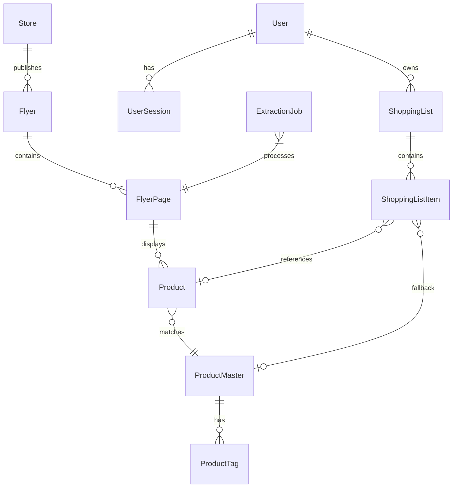

# Data Model: Kainuguru Grocery Flyer Aggregation System

**Date**: 2025-11-04
**Feature**: Kainuguru MVP

## Entity Relationship Overview



## Core Entities

### User
Registered platform user with authentication credentials and preferences.

```sql
CREATE TABLE users (
    id UUID PRIMARY KEY DEFAULT gen_random_uuid(),
    email VARCHAR(255) UNIQUE NOT NULL,
    email_verified BOOLEAN DEFAULT FALSE,
    password_hash VARCHAR(255) NOT NULL,
    full_name VARCHAR(255),
    preferred_language VARCHAR(10) DEFAULT 'lt',
    created_at TIMESTAMP WITH TIME ZONE DEFAULT NOW(),
    updated_at TIMESTAMP WITH TIME ZONE DEFAULT NOW(),
    last_login_at TIMESTAMP WITH TIME ZONE,
    is_active BOOLEAN DEFAULT TRUE,
    metadata JSONB DEFAULT '{}',

    -- OAuth ready fields
    oauth_provider VARCHAR(50),
    oauth_id VARCHAR(255),
    avatar_url TEXT,

    CONSTRAINT users_email_check CHECK (email ~* '^[A-Za-z0-9._%+-]+@[A-Za-z0-9.-]+\.[A-Za-z]{2,}$')
);

CREATE INDEX idx_users_email ON users(email);
CREATE INDEX idx_users_oauth ON users(oauth_provider, oauth_id) WHERE oauth_provider IS NOT NULL;
```

### UserSession
Active user sessions for JWT validation and management.

```sql
CREATE TABLE user_sessions (
    id UUID PRIMARY KEY DEFAULT gen_random_uuid(),
    user_id UUID NOT NULL REFERENCES users(id) ON DELETE CASCADE,
    token_hash VARCHAR(255) UNIQUE NOT NULL,
    expires_at TIMESTAMP WITH TIME ZONE NOT NULL,
    ip_address INET,
    user_agent TEXT,
    created_at TIMESTAMP WITH TIME ZONE DEFAULT NOW(),

    CONSTRAINT sessions_expiry_check CHECK (expires_at > created_at)
);

CREATE INDEX idx_sessions_user ON user_sessions(user_id);
CREATE INDEX idx_sessions_token ON user_sessions(token_hash);
CREATE INDEX idx_sessions_expires ON user_sessions(expires_at);
```

### Store
Grocery store chains with location and scraping configuration.

```sql
CREATE TABLE stores (
    id SERIAL PRIMARY KEY,
    code VARCHAR(50) UNIQUE NOT NULL, -- 'iki', 'maxima', 'rimi', etc
    name VARCHAR(100) NOT NULL,
    logo_url TEXT,
    website_url TEXT,
    flyer_source_url TEXT,

    -- Location data for future store-specific features
    locations JSONB DEFAULT '[]', -- Array of {lat, lng, address, city}

    -- Scraping configuration
    scraper_config JSONB DEFAULT '{}',
    scrape_schedule VARCHAR(50) DEFAULT 'weekly',
    last_scraped_at TIMESTAMP WITH TIME ZONE,

    is_active BOOLEAN DEFAULT TRUE,
    created_at TIMESTAMP WITH TIME ZONE DEFAULT NOW(),
    updated_at TIMESTAMP WITH TIME ZONE DEFAULT NOW()
);

CREATE INDEX idx_stores_code ON stores(code);
CREATE INDEX idx_stores_active ON stores(is_active);
```

### Flyer
Weekly promotional materials from stores.

```sql
CREATE TABLE flyers (
    id SERIAL PRIMARY KEY,
    store_id INTEGER NOT NULL REFERENCES stores(id),
    title VARCHAR(255),
    valid_from DATE NOT NULL,
    valid_to DATE NOT NULL,
    page_count INTEGER,
    source_url TEXT,

    -- Archival status from clarifications
    is_archived BOOLEAN DEFAULT FALSE,
    archived_at TIMESTAMP WITH TIME ZONE,

    -- Processing metadata
    status VARCHAR(50) DEFAULT 'pending', -- pending, processing, completed, failed
    extraction_started_at TIMESTAMP WITH TIME ZONE,
    extraction_completed_at TIMESTAMP WITH TIME ZONE,
    products_extracted INTEGER DEFAULT 0,

    created_at TIMESTAMP WITH TIME ZONE DEFAULT NOW(),
    updated_at TIMESTAMP WITH TIME ZONE DEFAULT NOW(),

    CONSTRAINT flyers_date_check CHECK (valid_to >= valid_from)
);

CREATE INDEX idx_flyers_store ON flyers(store_id);
CREATE INDEX idx_flyers_validity ON flyers(valid_from, valid_to);
CREATE INDEX idx_flyers_status ON flyers(status);
CREATE INDEX idx_flyers_current ON flyers(valid_from, valid_to)
    WHERE is_archived = FALSE;
```

### FlyerPage
Individual pages within a flyer for granular extraction tracking.

```sql
CREATE TABLE flyer_pages (
    id SERIAL PRIMARY KEY,
    flyer_id INTEGER NOT NULL REFERENCES flyers(id) ON DELETE CASCADE,
    page_number INTEGER NOT NULL,
    image_url TEXT,

    -- From clarifications: track extraction failures
    extraction_status VARCHAR(50) DEFAULT 'pending',
    extraction_attempts INTEGER DEFAULT 0,
    extraction_error TEXT,
    needs_manual_review BOOLEAN DEFAULT FALSE,

    -- Store extracted raw data for debugging
    raw_extraction_data JSONB,

    created_at TIMESTAMP WITH TIME ZONE DEFAULT NOW(),
    updated_at TIMESTAMP WITH TIME ZONE DEFAULT NOW(),

    UNIQUE(flyer_id, page_number)
);

CREATE INDEX idx_flyer_pages_flyer ON flyer_pages(flyer_id);
CREATE INDEX idx_flyer_pages_status ON flyer_pages(extraction_status);
CREATE INDEX idx_flyer_pages_review ON flyer_pages(needs_manual_review)
    WHERE needs_manual_review = TRUE;
```

### Product (Partitioned by Week)
Individual products extracted from flyers, partitioned weekly for performance.

```sql
CREATE TABLE products (
    id BIGSERIAL,
    flyer_id INTEGER NOT NULL,
    flyer_page_id INTEGER REFERENCES flyer_pages(id),
    store_id INTEGER NOT NULL,

    -- Product information
    name VARCHAR(255) NOT NULL,
    normalized_name VARCHAR(255) NOT NULL, -- Lithuanian chars normalized
    brand VARCHAR(100),
    description TEXT,

    -- Pricing
    price_current DECIMAL(10,2),
    price_original DECIMAL(10,2),
    discount_percentage DECIMAL(5,2),

    -- Units and quantity
    unit VARCHAR(50), -- '1L', '500g', 'vnt', etc
    quantity DECIMAL(10,3),

    -- Categorization
    category VARCHAR(100),
    tags TEXT[], -- Array of tags for search

    -- Matching to master catalog
    product_master_id INTEGER,
    matching_confidence DECIMAL(3,2), -- 0.00 to 1.00

    -- Dates for partitioning
    valid_from DATE NOT NULL,
    valid_to DATE NOT NULL,

    -- Search vectors
    search_vector tsvector,

    created_at TIMESTAMP WITH TIME ZONE DEFAULT NOW(),

    PRIMARY KEY (id, valid_from)
) PARTITION BY RANGE (valid_from);

-- Create function to auto-generate weekly partitions
CREATE OR REPLACE FUNCTION create_weekly_partition()
RETURNS void AS $$
DECLARE
    start_date date;
    end_date date;
    partition_name text;
BEGIN
    -- Calculate current week boundaries
    start_date := date_trunc('week', CURRENT_DATE)::date;
    end_date := start_date + INTERVAL '7 days';
    partition_name := 'products_' || to_char(start_date, 'YYYY_WW');

    -- Create partition if not exists
    IF NOT EXISTS (
        SELECT 1 FROM pg_class WHERE relname = partition_name
    ) THEN
        EXECUTE format(
            'CREATE TABLE %I PARTITION OF products FOR VALUES FROM (%L) TO (%L)',
            partition_name, start_date, end_date
        );

        -- Create indexes on new partition
        EXECUTE format('CREATE INDEX ON %I (flyer_id)', partition_name);
        EXECUTE format('CREATE INDEX ON %I (store_id)', partition_name);
        EXECUTE format('CREATE INDEX ON %I (product_master_id)', partition_name);
        EXECUTE format('CREATE INDEX ON %I USING gin(search_vector)', partition_name);
        EXECUTE format('CREATE INDEX ON %I USING gin(normalized_name gin_trgm_ops)', partition_name);
    END IF;
END;
$$ LANGUAGE plpgsql;

-- Trigger to update search vector
CREATE OR REPLACE FUNCTION update_product_search_vector()
RETURNS trigger AS $$
BEGIN
    NEW.search_vector := to_tsvector('lithuanian',
        COALESCE(NEW.name, '') || ' ' ||
        COALESCE(NEW.brand, '') || ' ' ||
        COALESCE(NEW.description, '')
    );
    RETURN NEW;
END;
$$ LANGUAGE plpgsql;

CREATE TRIGGER products_search_vector_trigger
BEFORE INSERT OR UPDATE ON products
FOR EACH ROW EXECUTE FUNCTION update_product_search_vector();
```

### ProductMaster
Normalized product catalog for cross-flyer matching.

```sql
CREATE TABLE product_masters (
    id SERIAL PRIMARY KEY,
    canonical_name VARCHAR(255) NOT NULL,
    normalized_name VARCHAR(255) NOT NULL,
    brand VARCHAR(100),
    category VARCHAR(100),

    -- Common attributes across variations
    typical_unit VARCHAR(50),
    barcode VARCHAR(50),

    -- Tags for matching (from clarifications)
    tags TEXT[] NOT NULL DEFAULT '{}',

    -- Statistics for improving matching
    occurrence_count INTEGER DEFAULT 0,
    last_seen_date DATE,
    average_price DECIMAL(10,2),

    created_at TIMESTAMP WITH TIME ZONE DEFAULT NOW(),
    updated_at TIMESTAMP WITH TIME ZONE DEFAULT NOW()
);

CREATE INDEX idx_product_masters_name ON product_masters(normalized_name);
CREATE INDEX idx_product_masters_tags ON product_masters USING gin(tags);
CREATE INDEX idx_product_masters_brand ON product_masters(brand);
CREATE INDEX idx_product_masters_barcode ON product_masters(barcode) WHERE barcode IS NOT NULL;
```

### ProductTag
Tags for categorization and search enhancement.

```sql
CREATE TABLE product_tags (
    id SERIAL PRIMARY KEY,
    tag_name VARCHAR(50) UNIQUE NOT NULL,
    tag_type VARCHAR(50), -- 'category', 'dietary', 'brand', 'promotion'
    lithuanian_name VARCHAR(100),
    english_name VARCHAR(100),
    parent_tag_id INTEGER REFERENCES product_tags(id),
    usage_count INTEGER DEFAULT 0,

    created_at TIMESTAMP WITH TIME ZONE DEFAULT NOW()
);

CREATE INDEX idx_tags_name ON product_tags(tag_name);
CREATE INDEX idx_tags_type ON product_tags(tag_type);
CREATE INDEX idx_tags_parent ON product_tags(parent_tag_id);
```

### ShoppingList
User-created shopping lists that persist across flyer updates.

```sql
CREATE TABLE shopping_lists (
    id UUID PRIMARY KEY DEFAULT gen_random_uuid(),
    user_id UUID NOT NULL REFERENCES users(id) ON DELETE CASCADE,
    name VARCHAR(255) NOT NULL,
    description TEXT,

    -- List metadata
    is_default BOOLEAN DEFAULT FALSE,
    is_shared BOOLEAN DEFAULT FALSE,
    share_token VARCHAR(100) UNIQUE,

    -- Statistics
    item_count INTEGER DEFAULT 0,
    completed_count INTEGER DEFAULT 0,
    estimated_total DECIMAL(10,2),

    created_at TIMESTAMP WITH TIME ZONE DEFAULT NOW(),
    updated_at TIMESTAMP WITH TIME ZONE DEFAULT NOW(),
    last_used_at TIMESTAMP WITH TIME ZONE,

    CONSTRAINT one_default_per_user UNIQUE(user_id, is_default)
);

CREATE INDEX idx_lists_user ON shopping_lists(user_id);
CREATE INDEX idx_lists_share_token ON shopping_lists(share_token) WHERE share_token IS NOT NULL;
```

### ShoppingListItem
Items in shopping lists with 3-tier matching strategy.

```sql
CREATE TABLE shopping_list_items (
    id UUID PRIMARY KEY DEFAULT gen_random_uuid(),
    shopping_list_id UUID NOT NULL REFERENCES shopping_lists(id) ON DELETE CASCADE,

    -- 3-tier identification from clarifications
    product_id BIGINT, -- Current product if available
    product_master_id INTEGER REFERENCES product_masters(id),
    text_description VARCHAR(255) NOT NULL, -- Fallback text

    -- Item details
    quantity INTEGER DEFAULT 1,
    unit VARCHAR(50),
    notes TEXT,

    -- Status tracking
    is_checked BOOLEAN DEFAULT FALSE,
    checked_at TIMESTAMP WITH TIME ZONE,

    -- From clarifications: handle unavailable products
    availability_status VARCHAR(50) DEFAULT 'available',
    last_match_date DATE,
    suggested_alternatives JSONB DEFAULT '[]',

    created_at TIMESTAMP WITH TIME ZONE DEFAULT NOW(),
    updated_at TIMESTAMP WITH TIME ZONE DEFAULT NOW(),
    position INTEGER DEFAULT 0 -- For ordering
);

CREATE INDEX idx_list_items_list ON shopping_list_items(shopping_list_id);
CREATE INDEX idx_list_items_product ON shopping_list_items(product_id);
CREATE INDEX idx_list_items_master ON shopping_list_items(product_master_id);
CREATE INDEX idx_list_items_position ON shopping_list_items(shopping_list_id, position);
```

### ExtractionJob
Queue for managing extraction tasks with SKIP LOCKED pattern.

```sql
CREATE TABLE extraction_jobs (
    id BIGSERIAL PRIMARY KEY,
    job_type VARCHAR(50) NOT NULL, -- 'scrape_flyer', 'extract_page', 'match_products'
    status VARCHAR(50) DEFAULT 'pending',
    priority INTEGER DEFAULT 5,

    -- Job payload
    payload JSONB NOT NULL,

    -- Processing metadata
    attempts INTEGER DEFAULT 0,
    max_attempts INTEGER DEFAULT 3,
    worker_id VARCHAR(100),
    started_at TIMESTAMP WITH TIME ZONE,
    completed_at TIMESTAMP WITH TIME ZONE,

    -- Error tracking
    error_message TEXT,
    error_count INTEGER DEFAULT 0,

    -- Scheduling
    scheduled_for TIMESTAMP WITH TIME ZONE DEFAULT NOW(),
    expires_at TIMESTAMP WITH TIME ZONE,

    created_at TIMESTAMP WITH TIME ZONE DEFAULT NOW(),
    updated_at TIMESTAMP WITH TIME ZONE DEFAULT NOW()
);

CREATE INDEX idx_jobs_status_scheduled ON extraction_jobs(status, scheduled_for)
    WHERE status = 'pending';
CREATE INDEX idx_jobs_type ON extraction_jobs(job_type);
CREATE INDEX idx_jobs_expires ON extraction_jobs(expires_at)
    WHERE expires_at IS NOT NULL;
```

## Data Constraints & Business Rules

### Validation Rules

1. **Email Validation**: Users must have valid email format
2. **Price Validation**: Current price cannot exceed original price
3. **Date Validation**: Flyer valid_to must be >= valid_from
4. **Unique Constraints**:
   - One default shopping list per user
   - Unique flyer page numbers per flyer
   - Unique store codes

### State Transitions

#### Flyer Status
```
pending → processing → completed
         ↓            ↓
        failed ← ─ ─ ─
```

#### Extraction Job Status
```
pending → processing → completed
         ↓            ↓
        failed → retry → failed (max attempts)
```

#### Shopping List Item Availability
```
available → unavailable (with suggestions)
           ↓
         re-matched (when new products arrive)
```

### Data Retention Policies

1. **Current Flyers**: Full data including images
2. **Archived Flyers**: Remove images, keep product data (from clarifications)
3. **Products**: Partitioned by week, old partitions can be dropped
4. **User Data**: Retained until account deletion
5. **Sessions**: Expire and clean up after 30 days

## Indexes and Performance

### Search Indexes
- Full-text search on products using Lithuanian configuration
- Trigram indexes for fuzzy matching
- GIN indexes on JSONB columns for metadata queries

### Query Optimization
- Partitioning products by week for fast current product queries
- Covering indexes for common query patterns
- Partial indexes for filtered queries (e.g., active stores)

### Connection Pooling
- Max 25 connections (from requirements)
- Separate read/write connection pools
- Connection timeout: 30 seconds

## Migration Strategy

### Initial Schema Creation Order
1. Independent tables: users, stores, product_tags
2. Dependent tables: flyers, product_masters, shopping_lists
3. Junction tables: flyer_pages, products, shopping_list_items
4. Create partitions for current and next week
5. Create all indexes
6. Insert seed data (stores, common tags)

### Partition Management
- Weekly cron job to create next week's partition
- Monthly job to archive/drop old partitions
- Automatic partition creation function included

## Security Considerations

1. **Password Storage**: bcrypt with cost factor 12
2. **Token Storage**: SHA-256 hashed tokens in database
3. **SQL Injection**: Parameterized queries only
4. **Rate Limiting**: Tracked in Redis, not database
5. **Data Privacy**: PII in users table only, shopping lists private by default