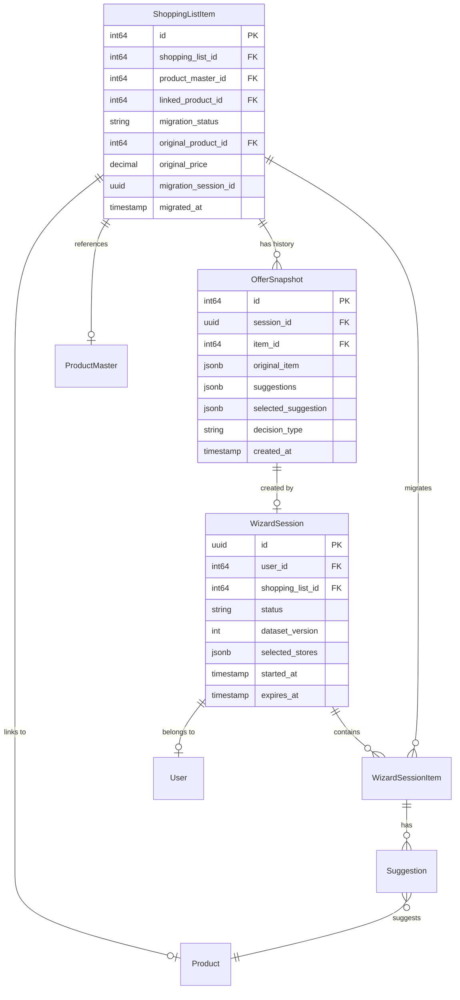

# Data Model: Shopping List Migration Wizard

**Feature**: Shopping List Migration Wizard
**Date**: 2025-11-15
**Status**: Final Design

## Entity Relationship Diagram



## Entity Specifications

### 1. ShoppingListItem (Extended)

**Purpose**: Track migration state and history for shopping list items

**New Fields** (backward-compatible additions):
```go
type ShoppingListItem struct {
    // ... existing fields ...

    // Migration tracking
    MigrationStatus     *string    `bun:"migration_status"`       // "pending", "migrated", "skipped"
    OriginalProductID   *int64     `bun:"original_product_id"`    // FK to products
    OriginalPrice       *float64   `bun:"original_price"`         // Price when expired
    MigrationSessionID  *uuid.UUID `bun:"migration_session_id"`   // Which wizard session
    MigratedAt         *time.Time `bun:"migrated_at"`            // When migrated
}
```

**Validation Rules**:
- MigrationStatus enum: NULL, "pending", "migrated", "skipped"
- OriginalProductID must reference valid products.id if set
- MigrationSessionID must reference valid wizard_sessions.id if set
- MigratedAt required when MigrationStatus = "migrated"

**State Transitions**:
```
NULL → "pending" (when flyer expires)
"pending" → "migrated" (when user accepts suggestion)
"pending" → "skipped" (when user skips item)
"migrated" → "pending" (if user wants to re-migrate)
```

### 2. WizardSession

**Purpose**: Maintain wizard state in Redis with metadata in PostgreSQL

**Redis Structure** (30-minute TTL):
```go
type WizardSession struct {
    ID              uuid.UUID              `json:"id"`
    UserID          int64                  `json:"user_id"`
    ShoppingListID  int64                  `json:"shopping_list_id"`
    Status          string                 `json:"status"`
    DatasetVersion  int                    `json:"dataset_version"`
    ExpiredItems    []WizardSessionItem   `json:"expired_items"`
    CurrentItemIndex int                   `json:"current_item_index"`
    SelectedStores  map[int]StoreSelection `json:"selected_stores"`
    Decisions       map[int64]Decision    `json:"decisions"`
    StartedAt       time.Time             `json:"started_at"`
    ExpiresAt       time.Time             `json:"expires_at"`
}

type WizardSessionItem struct {
    ItemID          int64     `json:"item_id"`
    ProductName     string    `json:"product_name"`
    Brand           *string   `json:"brand"`
    OriginalStore   *string   `json:"original_store"`
    OriginalPrice   float64   `json:"original_price"`
    Quantity        int       `json:"quantity"`
    ExpiryDate      time.Time `json:"expiry_date"`
}

type StoreSelection struct {
    StoreID    int     `json:"store_id"`
    StoreName  string  `json:"store_name"`
    ItemCount  int     `json:"item_count"`
    TotalPrice float64 `json:"total_price"`
}

type Decision struct {
    ItemID       int64      `json:"item_id"`
    Action       string     `json:"action"` // "replace", "skip", "remove"
    SuggestionID *int64     `json:"suggestion_id,omitempty"`
    Timestamp    time.Time  `json:"timestamp"`
}
```

**PostgreSQL Metadata** (for analytics):
```sql
CREATE TABLE wizard_sessions (
    id UUID PRIMARY KEY DEFAULT gen_random_uuid(),
    user_id INTEGER NOT NULL REFERENCES users(id),
    shopping_list_id INTEGER NOT NULL REFERENCES shopping_lists(id),
    status VARCHAR(20) NOT NULL DEFAULT 'active',
    dataset_version INTEGER NOT NULL,
    started_at TIMESTAMP NOT NULL DEFAULT NOW(),
    completed_at TIMESTAMP,
    completion_rate DECIMAL(5,2),
    items_migrated INTEGER DEFAULT 0,
    items_skipped INTEGER DEFAULT 0,
    items_removed INTEGER DEFAULT 0,
    selected_stores JSONB,
    created_at TIMESTAMP DEFAULT NOW()
);

CREATE INDEX idx_wizard_sessions_user ON wizard_sessions(user_id);
CREATE INDEX idx_wizard_sessions_status ON wizard_sessions(status);
```

**Validation Rules**:
- Status enum: "active", "completed", "expired", "cancelled"
- DatasetVersion must match current flyer data version
- Maximum 2 stores in SelectedStores
- ExpiresAt = StartedAt + 30 minutes

### 3. OfferSnapshot

**Purpose**: Immutable history of suggestions and decisions

**Schema**:
```sql
CREATE TABLE offer_snapshots (
    id BIGSERIAL PRIMARY KEY,
    session_id UUID NOT NULL REFERENCES wizard_sessions(id),
    item_id BIGINT NOT NULL REFERENCES shopping_list_items(id),
    original_item JSONB NOT NULL,
    suggestions JSONB NOT NULL,
    selected_suggestion JSONB,
    decision_type VARCHAR(20) NOT NULL,
    confidence_score DECIMAL(3,2),
    explanation TEXT,
    created_at TIMESTAMP NOT NULL DEFAULT NOW()
);

CREATE INDEX idx_offer_snapshots_session ON offer_snapshots(session_id);
CREATE INDEX idx_offer_snapshots_item ON offer_snapshots(item_id);
CREATE INDEX idx_offer_snapshots_created ON offer_snapshots(created_at);
```

**JSONB Structures**:
```typescript
// original_item
{
    "product_id": 12345,
    "product_name": "Coca-Cola 2L",
    "brand": "Coca-Cola",
    "store_id": 5,
    "store_name": "Maxima",
    "price": 2.49,
    "expiry_date": "2024-03-15"
}

// suggestions array
[
    {
        "product_id": 23456,
        "product_name": "Coca-Cola 1.5L",
        "brand": "Coca-Cola",
        "store_id": 7,
        "store_name": "Rimi",
        "price": 2.19,
        "score": 7.5,
        "confidence": 0.92,
        "matched_fields": ["brand", "name"],
        "explanation": "Same brand, similar size, €0.30 cheaper"
    }
]

// selected_suggestion (same structure as suggestion item)
```

**Validation Rules**:
- decision_type enum: "replace", "skip", "remove"
- confidence_score range: 0.00 to 1.00
- suggestions array must not be empty
- selected_suggestion required when decision_type = "replace"

### 4. Suggestion (Runtime Model)

**Purpose**: Ranked alternative products with scoring metadata

**Go Structure**:
```go
type Suggestion struct {
    Product         *Product           `json:"product"`
    Score           float64            `json:"score"`
    Confidence      float64            `json:"confidence"`
    Explanation     string             `json:"explanation"`
    MatchedFields   []string           `json:"matched_fields"`
    ScoreBreakdown  ScoreBreakdown     `json:"score_breakdown"`
}

type ScoreBreakdown struct {
    BrandScore      float64 `json:"brand_score"`      // 0-3.0
    StoreScore      float64 `json:"store_score"`      // 0-2.0
    SizeScore       float64 `json:"size_score"`       // 0-1.0
    PriceScore      float64 `json:"price_score"`      // 0-1.0
    TotalScore      float64 `json:"total_score"`      // Sum of above
}
```

**Scoring Algorithm**:
```go
func CalculateScore(original, suggestion *Product) ScoreBreakdown {
    score := ScoreBreakdown{}

    // Brand match (3.0 points)
    if original.Brand == suggestion.Brand {
        score.BrandScore = 3.0
    }

    // Store match (2.0 points)
    if original.StoreID == suggestion.StoreID {
        score.StoreScore = 2.0
    }

    // Size similarity (1.0 points)
    if suggestion.Size != nil && original.Size != nil {
        ratio := min(*suggestion.Size, *original.Size) /
                 max(*suggestion.Size, *original.Size)
        score.SizeScore = ratio // 0-1.0 based on similarity
    }

    // Price advantage (1.0 points)
    if suggestion.Price < original.Price {
        score.PriceScore = min(1.0, (original.Price - suggestion.Price) / original.Price)
    }

    score.TotalScore = score.BrandScore + score.StoreScore +
                       score.SizeScore + score.PriceScore
    return score
}
```

**Confidence Calculation**:
```go
func CalculateConfidence(searchScore float64, matchedFields []string) float64 {
    // Base confidence from search similarity
    confidence := searchScore * 0.7

    // Boost for field matches
    fieldBoost := float64(len(matchedFields)) * 0.1
    confidence += min(fieldBoost, 0.3)

    return min(confidence, 1.0)
}
```

### 5. UserMigrationPreferences

**Purpose**: Store user preferences for future migrations

**Schema**:
```sql
CREATE TABLE user_migration_preferences (
    id BIGSERIAL PRIMARY KEY,
    user_id INTEGER NOT NULL REFERENCES users(id),
    preferred_stores JSONB,
    brand_preferences JSONB,
    auto_accept_threshold DECIMAL(3,2) DEFAULT 0.95,
    max_price_increase DECIMAL(5,2) DEFAULT 1.00,
    skip_categories JSONB,
    created_at TIMESTAMP DEFAULT NOW(),
    updated_at TIMESTAMP DEFAULT NOW(),
    UNIQUE(user_id)
);
```

**JSONB Structures**:
```typescript
// preferred_stores
{
    "primary": 5,    // Maxima
    "secondary": 7   // Rimi
}

// brand_preferences
{
    "cola": ["Coca-Cola", "Pepsi"],
    "milk": ["Žemaitijos", "Vilkyškių"],
    "bread": ["Gardėsis"]
}

// skip_categories
["alcohol", "tobacco"]
```

## Database Migrations

### Migration 034: Add Wizard Tables

```sql
-- +goose Up
-- Add migration fields to shopping_list_items
ALTER TABLE shopping_list_items
ADD COLUMN IF NOT EXISTS migration_status VARCHAR(20) DEFAULT NULL,
ADD COLUMN IF NOT EXISTS original_product_id INTEGER REFERENCES products(id),
ADD COLUMN IF NOT EXISTS original_price DECIMAL(10,2),
ADD COLUMN IF NOT EXISTS migration_session_id UUID,
ADD COLUMN IF NOT EXISTS migrated_at TIMESTAMP;

-- Create wizard sessions table
CREATE TABLE IF NOT EXISTS wizard_sessions (
    id UUID PRIMARY KEY DEFAULT gen_random_uuid(),
    user_id INTEGER NOT NULL REFERENCES users(id) ON DELETE CASCADE,
    shopping_list_id INTEGER NOT NULL REFERENCES shopping_lists(id) ON DELETE CASCADE,
    status VARCHAR(20) NOT NULL DEFAULT 'active',
    dataset_version INTEGER NOT NULL,
    started_at TIMESTAMP NOT NULL DEFAULT NOW(),
    completed_at TIMESTAMP,
    completion_rate DECIMAL(5,2),
    items_migrated INTEGER DEFAULT 0,
    items_skipped INTEGER DEFAULT 0,
    items_removed INTEGER DEFAULT 0,
    selected_stores JSONB,
    created_at TIMESTAMP DEFAULT NOW()
);

-- Create offer snapshots table
CREATE TABLE IF NOT EXISTS offer_snapshots (
    id BIGSERIAL PRIMARY KEY,
    session_id UUID NOT NULL REFERENCES wizard_sessions(id) ON DELETE CASCADE,
    item_id BIGINT NOT NULL REFERENCES shopping_list_items(id) ON DELETE CASCADE,
    original_item JSONB NOT NULL,
    suggestions JSONB NOT NULL,
    selected_suggestion JSONB,
    decision_type VARCHAR(20) NOT NULL,
    confidence_score DECIMAL(3,2),
    explanation TEXT,
    created_at TIMESTAMP NOT NULL DEFAULT NOW()
);

-- Create user preferences table
CREATE TABLE IF NOT EXISTS user_migration_preferences (
    id BIGSERIAL PRIMARY KEY,
    user_id INTEGER NOT NULL REFERENCES users(id) ON DELETE CASCADE,
    preferred_stores JSONB,
    brand_preferences JSONB,
    auto_accept_threshold DECIMAL(3,2) DEFAULT 0.95,
    max_price_increase DECIMAL(5,2) DEFAULT 1.00,
    skip_categories JSONB,
    created_at TIMESTAMP DEFAULT NOW(),
    updated_at TIMESTAMP DEFAULT NOW(),
    UNIQUE(user_id)
);

-- Add indexes
CREATE INDEX idx_shopping_list_items_migration ON shopping_list_items(migration_status)
    WHERE migration_status IS NOT NULL;
CREATE INDEX idx_wizard_sessions_user ON wizard_sessions(user_id);
CREATE INDEX idx_wizard_sessions_status ON wizard_sessions(status);
CREATE INDEX idx_offer_snapshots_session ON offer_snapshots(session_id);
CREATE INDEX idx_offer_snapshots_item ON offer_snapshots(item_id);
CREATE INDEX idx_offer_snapshots_created ON offer_snapshots(created_at);

-- +goose Down
DROP TABLE IF EXISTS user_migration_preferences;
DROP TABLE IF EXISTS offer_snapshots;
DROP TABLE IF EXISTS wizard_sessions;

ALTER TABLE shopping_list_items
DROP COLUMN IF EXISTS migration_status,
DROP COLUMN IF EXISTS original_product_id,
DROP COLUMN IF EXISTS original_price,
DROP COLUMN IF EXISTS migration_session_id,
DROP COLUMN IF EXISTS migrated_at;
```

## Data Integrity Rules

### Referential Integrity
- All foreign keys use appropriate CASCADE rules
- Wizard sessions cascade delete to offer snapshots
- User deletion cascades to preferences and sessions

### Business Rules
1. **Store Limit**: Maximum 2 stores per wizard session
2. **Session Timeout**: Auto-expire after 30 minutes
3. **Dataset Freshness**: Reject if dataset_version changed
4. **Idempotency**: Use migration_session_id to prevent double-apply
5. **Audit Trail**: All decisions recorded in offer_snapshots

### Performance Considerations
- Index on migration_status for quick expired item queries
- Partial index excludes NULL migration_status (majority of records)
- JSONB for flexible schema evolution
- Session data in Redis for sub-second access

## Access Patterns

### Common Queries

**Find expired items for user**:
```sql
SELECT sli.*, p.name as product_name, pm.brand
FROM shopping_list_items sli
LEFT JOIN products p ON sli.linked_product_id = p.id
LEFT JOIN product_masters pm ON sli.product_master_id = pm.id
WHERE sli.shopping_list_id = $1
  AND sli.migration_status = 'pending'
ORDER BY sli.sort_order;
```

**Get suggestion history**:
```sql
SELECT os.*, sli.name as item_name
FROM offer_snapshots os
JOIN shopping_list_items sli ON os.item_id = sli.id
WHERE os.session_id = $1
ORDER BY os.created_at;
```

**Calculate user statistics**:
```sql
SELECT
    COUNT(*) as total_migrations,
    AVG(completion_rate) as avg_completion,
    SUM(items_migrated) as total_items_migrated,
    SUM(items_skipped) as total_items_skipped
FROM wizard_sessions
WHERE user_id = $1
  AND status = 'completed';
```

## Summary

This data model provides:
- ✅ Backward-compatible extensions to existing tables
- ✅ Immutable audit trail through offer_snapshots
- ✅ Efficient session management with Redis
- ✅ User preference learning for future improvements
- ✅ Strong data integrity with proper constraints
- ✅ Performance optimization through strategic indexing